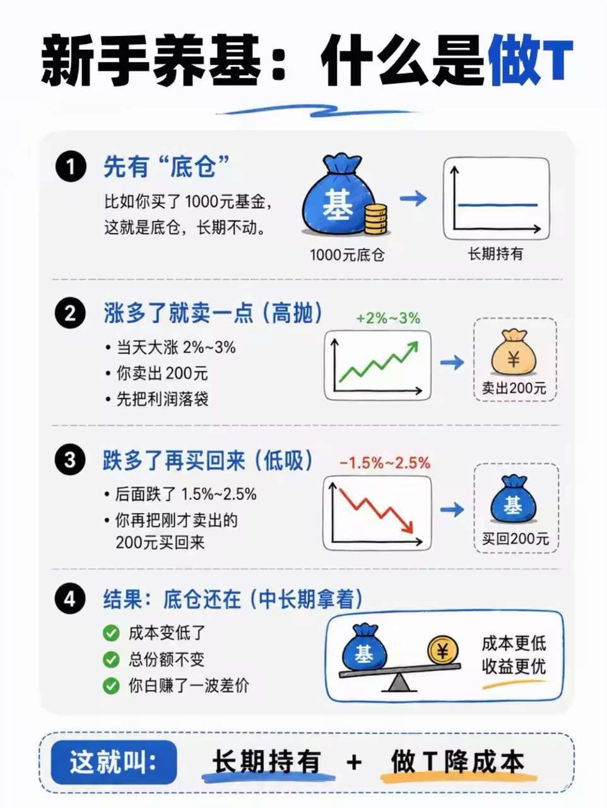
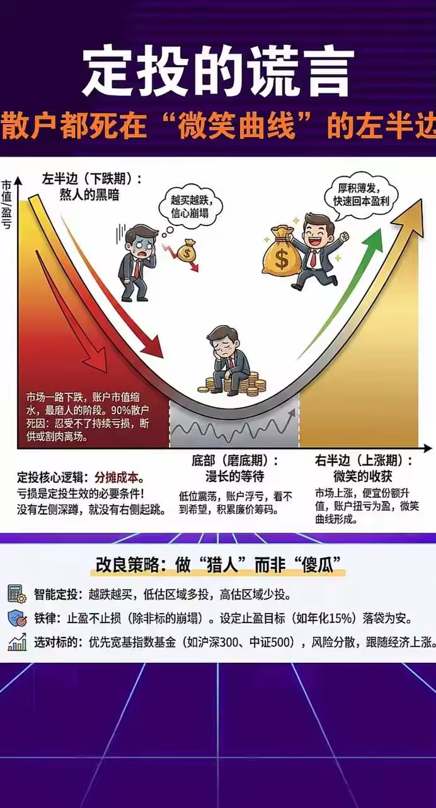

# 投资理财基础
## 收益与复利
- 72法则（在 6%~10% 收益率区间最准确）：“资产在固定复利收益率下，需要多少年才能翻倍”的经验公式，本金翻倍年数约等于72/年收益率，​例如：

| 年化收益率 | 资产翻倍时间 |
|---|---|
| 1% | 72 年 |
| 2% | 36 年 |
| 4% | 18 年 |
| 6% | 12 年 |
| 8% | 9 年 |
| 12% | 6 年 |
- 72法则与通货膨胀率的关系：假设现在通货膨胀率是3%，72/3=24,24年之后，100元的购买力相当于现在的50元了
## 估值指标
- PE：市盈率（看盈利能力）例如：当前PE处于历史%分位，当前PE是PE=12，历史最高 PE=30，历史最低 PE=8，当前分位 = (12-8) / (30-8) ≈ 18%，比历史上 82% 的时间都便宜，可能是低估区间
- PB：市净率（看资产价值）你花多少钱买 1 块钱的净资产（公司的厂房、设备、现金等）。PB=0.8 意味着你能用 8 毛钱买到 1 块钱的资产
- 跟踪误差：跟踪误差小于0.5%良好，小于0.2%优秀（跟踪误差小 = 基金经理没有自作主张去买指数之外的股票。）
## 风险指标
- 夏普比率（性价比指标）：每承受一单位风险，能换来多少超额收益，夏普比率是否达到优秀的指标：

| 夏普比率 | 评价 |
|---|---|
| < 0 | 不如买国债（亏） |
| 0 - 0.5 | 一般 |
| 0.5 - 1 | 良好 |
| > 1 | 优秀 |

- 最大回撤：历史上，你买入之后可能遇到的"最惨的时候亏多少%"（**定投可以降低实际上感受到的回撤，因为是分批买入，不是在最高点一把梭**）

参考价值：如果一只基金的最大回撤是30%，但你最多只能接受亏10%，那这支基金就不适合你

| 基金类型 | 典型最大回撤 | 含义 |
|---|---|---|
| 短债基金 | 0.5% 以内 | 几乎不会亏 |
| 长期纯债基金 | 3% - 8% | 小亏，能较快修复 |
| 沪深300指数基金 | 40% 左右 | 可能大亏，但历史上都回来了 |

## 基金分类
  | 风险等级 | 投资品 | 预期收益 | 波动性 | 最大回撤特征 | 特点说明 |
  |---|---|---|---|---|---|
  | R1 | 银行存款 / 活期 / 定期 | 1%~2% | 极低 | 几乎为0 | 本金安全性最高，收益最低 |
  | R2 | 国债 / 政府债券 | 2%~3.5% | 很低 | 极小 | 由国家信用背书，违约风险极低 |
  | R3 | 货币基金（如余额宝） | 1.5%~3% | 很低 | 接近0 | 流动性强，类似现金管理工具 |
  | R4 | 短债基金 | 2%~4% | 低 | 0.5%以内 | 波动小，适合稳健配置 |
  | R5 | 中长期债券基金 | 3%~6% | 低~中 | 3%~8% | 受利率影响，存在周期波动 |
  | R6 | 偏债混合型基金 | 3%~7% | 中 | 5%~10% | 债券为主、少量股票，攻守兼备 |
  | R7 | 偏股混合型基金 | 5%~12% | 中~高 | 15%~30% | 股票仓位灵活，回撤比纯股基金小 |
  | R8 | 宽基指数基金（沪深300） | 6%~12% | 高 | 40%~50% | 跟随市场整体，长期有效，满仓运行 |
  | R8 | 主动股票基金 | 5%~15%+ | 高 | 30%~50% | 依赖基金经理能力，好的能控制回撤 |
  | R9 | 行业/主题ETF（证券、科技、医药等） | -50%~50%+ | 很高 | 50%~70% | 单一行业波动极大，弹性高但风险集中 |
  | R9 | 个股（蓝筹/成长股） | -100%~∞ | 很高 | 50%~90%+ | 收益分化极大，风险集中，需要选股能力 |
  | R10 | 杠杆产品 / 期货 / 加密货币 | -100%~∞ | 极高 | 可能归零 | 高收益高风险，适合专业投资者 |

## 场内基金和场外基金
  | | **场内基金** | **场外基金** |
  |---|---|---|
  | **在哪买** | 证券账户（股票软件） | 基金公司、支付宝、天天基金等 |
  | **交易方式** | 像股票一样实时买卖，价格实时变动 | 按每天收盘后的净值申购/赎回 |
  | **到账时间** | 卖出当天到账，马上可用 | 赎回通常1-3个工作日到账 |
  | **手续费** | 佣金，一般万分之一到万分之三 | 申购费+赎回费，通常更高 |
  | **门槛** | 最少买1手（100份） | 一般1元起投 |
  | **交易时间** | 盘中随时（9:30-15:00） | 15:00前按当天净值，之后按下个交易日 |
  | **品种** | 主要是ETF、LOF | 所有基金都有场外版本 |

## 投资方法
### 做T
- 适合场内基金,像股票实时交易那种

### 定投
适合场外基金(通过基金公司、支付宝、银行等第三方销售平台进行申购和赎回)
- 长期定投
- 逢低加仓 + 止盈策略

## 市场结构
- 交易所：股票买卖的官方菜市场，想买股票不是直接找公司买，而是去交易所这个菜市场，在银行、券商APP上下单，中国内地有两个交易所
    - 上海证券交易所(沪市)
    - 深圳证券交易所(深市)

## 市场周期与熊牛市
- 牛市：股票市场持续上涨，大多数人都在赚钱，情绪非常乐观的一段时期
- 熊市：股票市场持续下跌，大多数人都在亏钱，市场情绪悲观、恐慌的一段时期。
