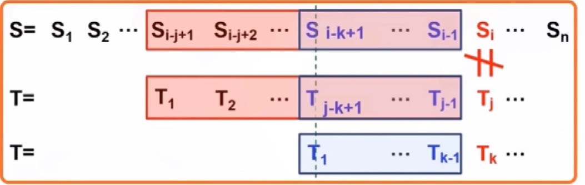
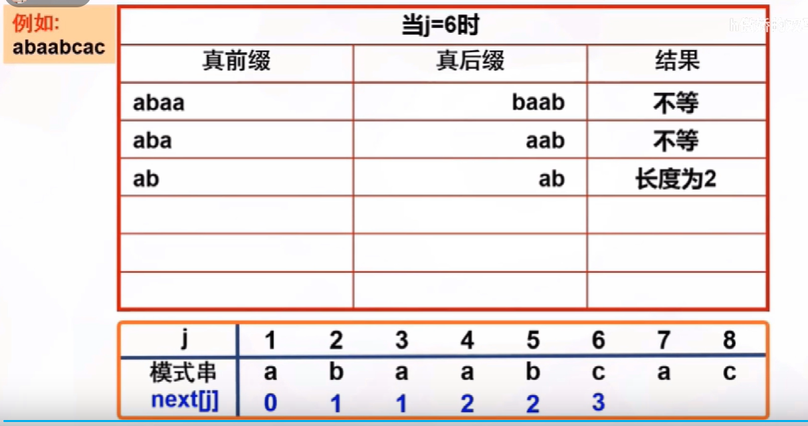
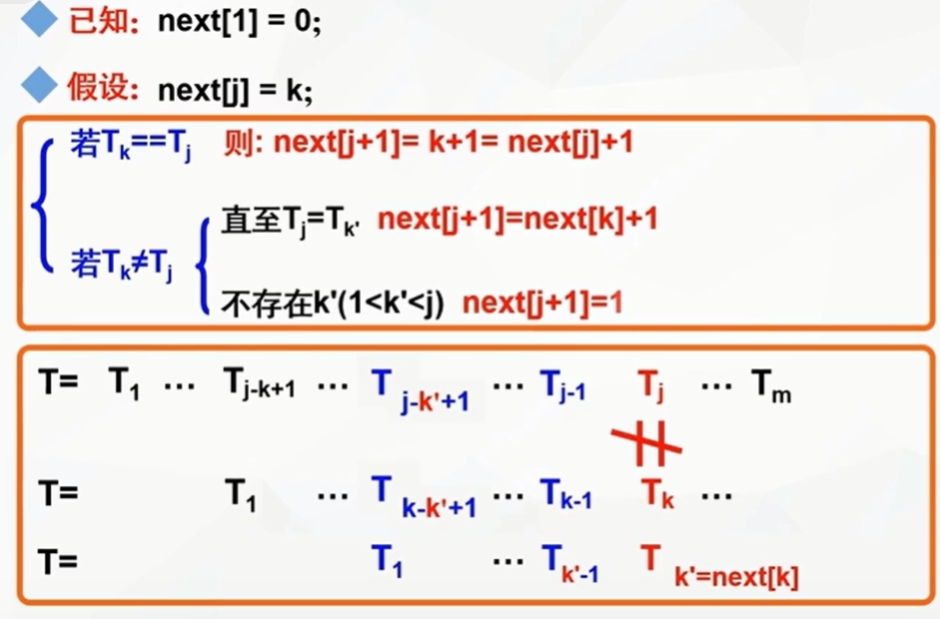
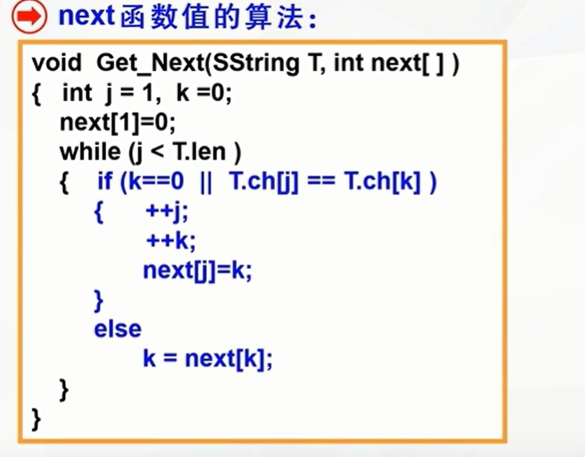

KMP算法是一种字符串匹配算法，可以在O(n+m)的时间复杂度内实现两个字符串的匹配，而使用暴力的时间复杂度是O(m*n)
假设主串为S，正比较的下标为i,模式串为T,正比较的下标为j,(注意j的开始下标是从1开始的)因为暴力解法每次都是回溯了i，而KMP的做法就是让i不回溯，如果不匹配，每次改变的都是j的值，而j的值就是对应的next[j],KMP的核心部分就是求取next数组的值
## 如何使用next数组？

- 从主串和模式串的第pos个字符开始进行比较,j=1
- 如果字符相等，继续逐个比较后续字符，i++,j++
- 如果j==0,(j=next[j]=0)这表示模式串的第一个字符和T[i]匹配不成功，则应该i++,j++
- 如果两个字符不相等，主串位置i不发生变化，j=next[j],然后比较S[i]和T[j]
## 何时匹配成功?

1. 如果匹配成功(j>S.len)，返回模式串第一个字符相对应在主串中的序号，return i-S.len
2. 如果匹配不成功，返回-1

## next的计算思想

也就是说真前缀和真后缀的值要尽可能大，这样移动的模式串移动的距离就是最远的
所以求next数组的值只需要通过模式串就可以计算

