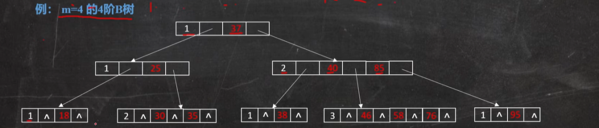

## AVL树(平衡二叉搜索树)
### 几种旋转的方式

- LL右单旋转
- RR左单旋转
- LR先左后右
- RL先右后左
## 红黑树
主要是为了解决AVL树插入，删除，修改结点的时候调整开销过大，旋转次数少于AVL树，但是它不适合做文件系统的索引，因为红黑树是二叉树，如果数据量一多，树就会比较深
### 特点

- 最长子树不超过最短子树的2倍（并不是完全平衡的）
- 根结点必须是黑色的
- 红色结点的两个子结点必须是黑色
- 从任意结点到其每个叶子结点的所有路径包含相同数目的黑色结点
## B树
### 定义
又称为平衡多路查找树(查找路径不止两个),有的教材称为B-树，常见的使用场景一般是在数据库索引技术中，大量使用了B树和B+树，B树大多用在磁盘上用于查找磁盘的地址.

### 特点

- 定义任意非叶子结点最多只有M个儿子，且M>2(至多有m-1个关键字),这个m是我们手动设置的
- 所有结点的关键字是按递增次序排列，并遵循左小右大的原则
- 每个叶子结点到根结点的路径长度是相等的，这种平衡性可以保证在最坏的情况下搜索时间复杂度是O(logn)
## B+树
## 为什么不使用哈希表做文件系统的索引？

- 不支持范围查询：哈希表是基于键值对的数据结构，而在文件系统中，我们经常需要根据文件名称，创建时间，大小等属性进行范围查询
- 不支持模糊匹配：文件系统中的索引通常需要支持模糊匹配
- 不支持顺序访问：哈希表中的键是无序的，因此无法安装特定的顺序访问索引
- 存储空间的浪费：哈希表需要提前分配足够大的存储空间以容纳可能的键值对
