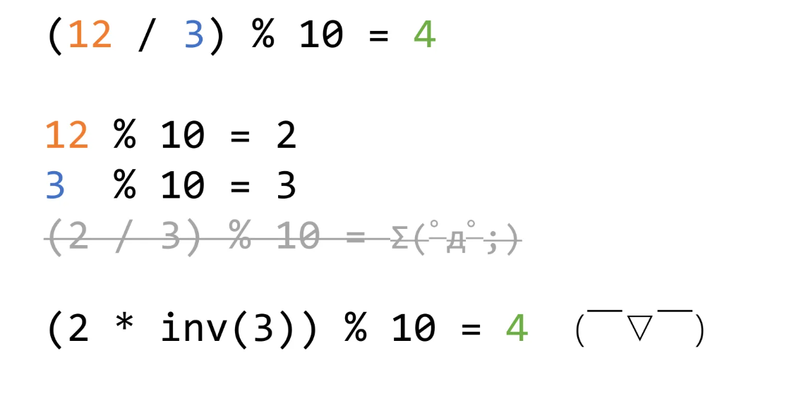

- 对于任意一个正整数，可以将它分解为n个质因子幂的乘积之和，例如:36=2^2+3^3,

[质因数例题](https://blog.csdn.net/Tisfy/article/details/125706956)

- 数根，比如：38——>3+8=11——>1+1=2，则2就是38的一个数根，对于任意一个非负整数而言，它的数根为(n-1)%9+1
- gcd(最大公约数)
- 辗转相除法：用于求两个整数的最大公约数(古希腊人发明)
```javascript
function gcd(a, b) {
    if (a % b === 0) {
        return b;
    }
    return gcd(b, a % b);
}

```

- 更相减损法：用于求两个整数的最大公约数(中国人发明)

  
```javascript
function gcd(a, b) {
    while (a !== b) {
        if (a > b) {
            a = a - b;
        } else {
            b = b - a;
        }
    }
    return a;
}
```

- 容斥定理
   - 两个集合的容斥关系公式:AUB=|AUB|=|A|+|B|-|A∩B|
   - 三个集合的容斥关系公式:AUBUC=|A|+|B|+|C|-|A∩B|-|B∩C|-|C∩A|+|A∩B∩C|
   - 四个集合的容斥关系公式：|A∪B∪C∪D|=|A|+|B|+|C|+|D|-|A∩B|-|A∩C|-|A∩D|-|B∩C|-|B∩D|-|C∩D|+|A∩B∩C|+|A∩B∩D|+|A∩C∩D|+|B∩C∩D|-|A∩B∩C∩D| 
   - 

- lcm:最小公倍数：两个数的乘积/两个数的最大公约数
- 哥德巴赫猜想，任何一个大于2的偶数，都可以表示成两个素数之和
- 任何一个平方数都可以表示成这样：
   - n^2=1+3+5+7+...
- 扩展欧几里：如果两个数不是互质的(也就是最大公约数不为1),那么他们组合不出来的数(这两个数的任意倍数之和）有无穷个，例如:2,4的最大公约数为2，它们不能组合出来的数有，3,6,9,15....,如果是2和3组合，他们很够不能够组合的数就是有限的。。
- 逆元:(a/b)mod c=(a*inv(b)) mod c，inv(b)可以看做在模c意义下的1/b，例如：


对于这个式子而言,inv(3)表示在模10的情况下，inv(3)等于7
