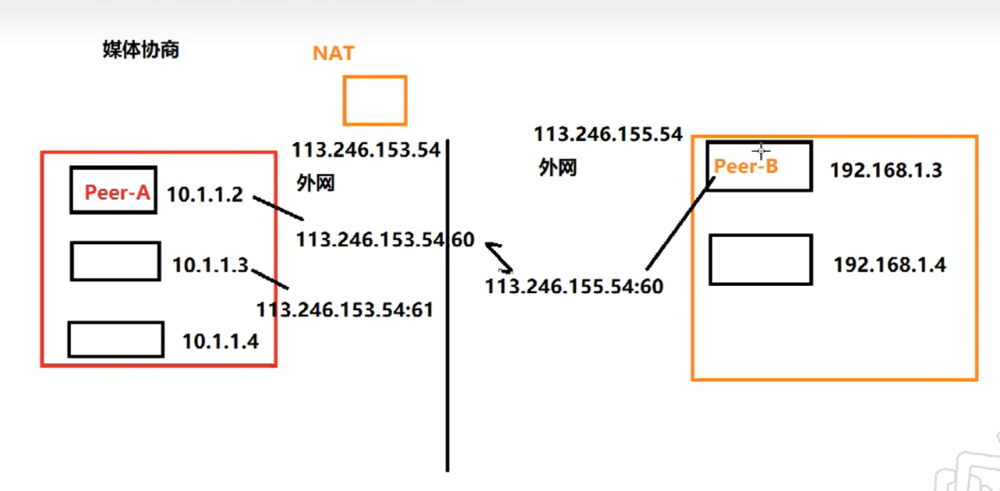
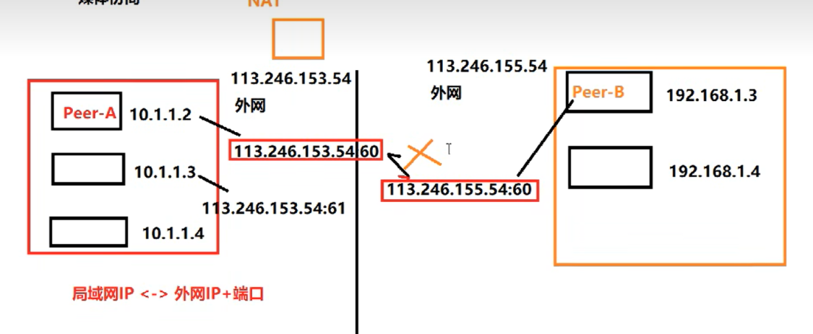
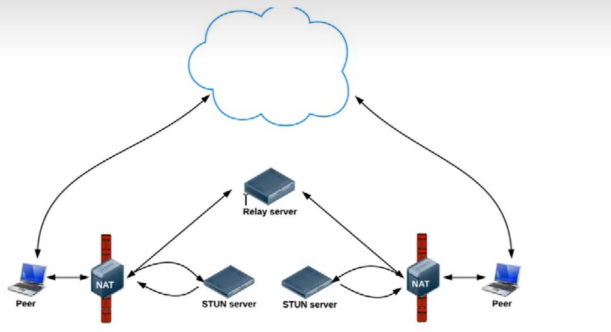

## webRTC简介以及用途
基于UDP协议的网络通讯协议，主要用于音视频通话
## 媒体协商
彼此了解对方支持的媒体格式，注意：有一个专门的协议，称为session description protocol(SDP)，可用描述上述这类信息，在webrtc中，参与视频通讯的双方必须先交换SDP信息，这样双方就能够知根知底，而交换SDP的过程，也称为"媒体协商"
## 网络协商
彼此要了解对方的网络情况，这样才有可能找到一条相互通讯的链路

1. 获取外网IP地址的映射
2. 通过信令服务器交换"网络信息"

理想的网络情况是每个浏览器的电脑都是私有公网IP，可以直接进行点对点连接
实际情况是：我们的电脑和电脑之前或大或小都是在某个局域网中，需要NAT(network address transform，网络地址转换)

### STUN
STUN是一种网络协议，它允许位于NAT（或者多重NAT）后的客服端找到自己对应的公网地址，查出自己位于哪种类型的NAT之后以及NAT为某一个本地端口所绑定的Internet端端口，这些信息被用来在两个同时处于NAT路由器之后的主据之间创建UDP通信，该协议由RFC 5389定义。

## TURN

主要添加了一个中继的功能，拿上图举例，如果两个外网联不通，就需要这个TURN协议，可以联通的话就是用STUN服务。
在STUN分配公网IP失败后，可以通过TURN服务器请求公网IP地址作为中继地址，**这种方式的带宽由服务器承担**，在多人视频聊天的时候，本地带宽压力较小，并且，根据Google的说明，TURN协议可以使用在所有环境中。

## 媒体协商+网络协商数据的交换通道
从上面我们知道了2个客服端协商媒体信息和网络信息，那怎么去交换呢？是不是需要一个中间商去交换？所以我们需要一个信令服务器(Signal Server)转发必须的媒体信息和网络信息,我们在基于webRTC API开发应用(APP)时，可以将彼此的APP连接到信令服务器(Signal Server，一般搭建在公网,或者两端都可以访问到的局域网)，借助信令服务器，就可以实现上面提到的SDP媒体信息以及网络信息交换。
信令服务器不只是交互媒体信息sdp和网络信息candidata,比如：

   1. 房间的管理
   2. 人员进出房间

