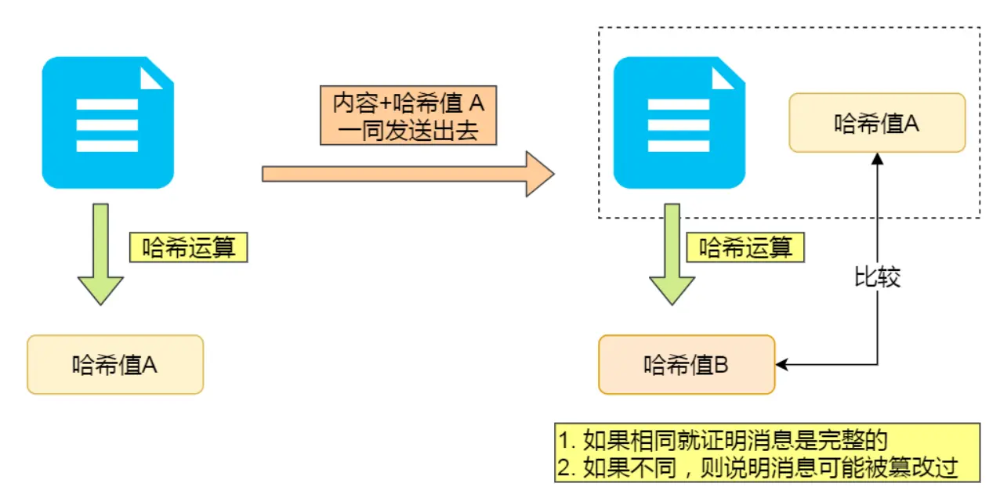

## HTTPS通信过程
1. 服务端启动后生成一对公钥私钥，服务器将公钥发送给CA，请求CA签发数字证书，CA使用自己的私钥对其进行数字签名，并生成数字证书
2. tcp三握手过程
3. 客服端服务端协商加密方式：
   1. 客服端生成一个随机数:random1,发送Client Hello消息，包含客服端支持的所有加密方式
   2. 服务端从这些加密方式中选择自己合适的加密方式，并生成随机数random2返回
4. 证书验证：
   1. 服务端向客服端发送数字证书
   2. 浏览器内置的CA数字证书库对其进行验证，内置的CA证书的公钥对其解密，验证服务端身份。(如果能够解密就一定是CA颁发的合法的证书)
   3. 客服端，证书通过验证后，生成一个随机数random3,并使用证书中解密出来的公钥进行加密，发送给服务端
   4. 服务端利用自己的私钥进行解密，至此，会话密钥random1+random2+random3生成
5. 对称加密通信：后续的通信过程客服端和服务端都是用会话密钥进行通信。(非对称加密的方式速度较慢)

## FAQ
- https采用了对称加密的方式还是非对称加密的方式？
https采用的是混合加密的方式，两种都用到了。
- https采用混合加密的原因？
   - 对称加密只使用一个密钥，运算速度快，密钥必须保密，无法做到安全的密钥交换。
   - 非对称加密使用两个密钥：公钥和私钥，公钥可以任意分发而私钥保密，解决了密钥交换问题但速度慢。
1. https如何保证内容的完整性？

> 使用摘要算法(哈希函数)来计算内容的哈希值，也就是内容的指纹，这个哈希值是唯一的，且无法通过哈希值来推导内容。Tips:单纯的摘要算法并不能够保证[内容+哈希值]不会被中间人替换，因为这里缺少对客户端收到的消息是否来源于服务端的证明，所以https使用非对称加密的方式来解决这个问题。
---

> 注意，私钥加密的不是内容本身，而是对内容的哈希值进行加密

2. 如何进行身份验证？(公钥和私钥有可能是伪造的)
