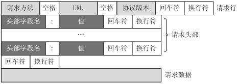
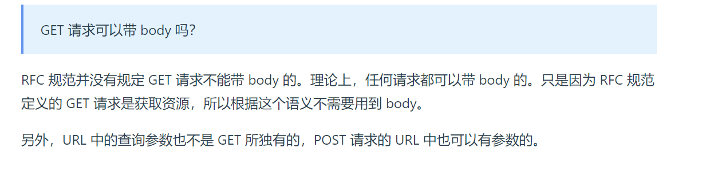
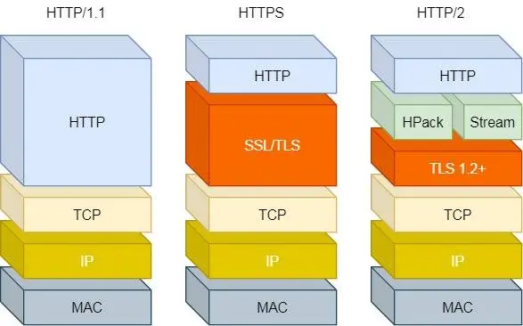
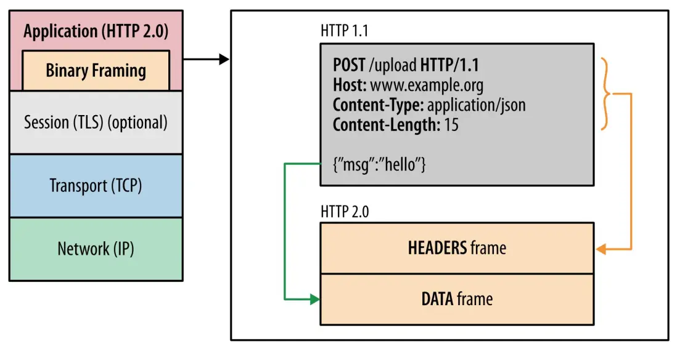
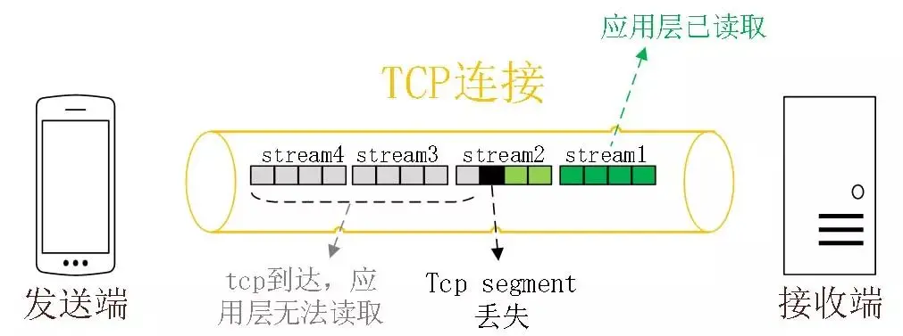

## HTTP请求报文格式
一个HTTP请求报文由请求行（request line）、请求头部（header）、空行和请求数据4个部分组成

## GET请求和POST请求的区别
1. 
    - GET的参数位置一般是写在URL地址中，URL规定只支持ASCII，所以GET请求的参数只允许ASCII字符，而且浏览器会对URL的长度会有限制(HTTP协议本身并没有对URL的长度有限制)。
    - POST的语义是根据请求负荷（报文body）对指定的资源做出处理，浏览器不会对 body 大小做限制
2. 
    - GET方法是安全且幂等的，无论操作多少次，服务器上的数据都是安全的，且每次的结果都是一样的，所以，可以对 GET 请求的数据做缓存，这个缓存可以做到浏览器本身上
    - POST 因为是「新增或提交数据」的操作，会修改服务器上的资源，所以是不安全的，且多次提交数据就会创建多个资源，所以不是幂等的。所以，浏览器一般不会缓存 POST 请求，也不能把 POST 请求保存为书签。
---

## HTTP/1.1相对于HTTP/1.0提高了什么性能？
1. 使用长连接的形式改善了HTTP1.0短连接导致的性能开销(这里指的是TCP连接)
2. 使用管道网络传输，只要第一个请求发出去了，就可以发送第二个请求，无需等待第一个请求响应。
---
**HTTP/1.1性能瓶颈**
- 请求/响应头部未经过压缩就发送，只能够压缩body部分
- 发送冗余的首部，每次互相发送相同的首部造成的浪费较多。
- 服务器是按照顺序响应的，如果服务器响应比较慢，会导致客服端一直请求不到数据，也就是**队头阻塞**的问题。
- 没有请求优先级控制。
- 请求只能够从客服端开始，服务端只能够被动响应。

## HTTP/2做了什么优化？
HTTP/2是基于HTTPS的，所以HTTP/2的安全性也是有保障的

1. 头部压缩：如果你同时发出多个请求，他们的头部都是一样的或者是相似的，那么，协议会帮助你消除重复的部分。  
这就是所谓的`HPACK`算法：在客户端和服务器同时维护一张头信息表，所有字段都会存入这个表，生成一个索引号，以后就不发送同样字段了，只发送索引号，这样就提高速度了。
2. 二进制格式：HTTP/2不再想HTTP/1.1里面的纯文本形式的报文，而是全面采用二进制格式，头部信息和数据都是二进制，并且统称为帧：*头信息帧和数据帧*

> Tip:收到报文之后，无需将明文的报文转换为二进制，而是直接姐写二进制报文，这增加了数据传输的效率。
3. 并发传输：(解决了队头阻塞的问题)，多个Stream服用同一条TCP连接，一个TCP连接包含多个Stream,Stream里面可以包含一个或者多个Message,Message对应HTTP/1中的请求或者响应，由HTTP头部和包体构成，Message里面的包含了一条或者多条Frame,Frame是HTTP/2中的最小单位，以二进制压缩格式存放HTTP/1中的内容(头部和包体)。  
针对不同的HTTP请求使用独一无二的Stream ID来区分，接收端可以通过Stream ID有序组装成HTTP消息，不同Stream的帧是可以乱序发送的，因此可以并发不同的Stream，也就是 HTTP/2 可以并行交错地发送请求和响应。

4. 服务器推送：客服端和服务器双方都可以建立Stream,Stream Id是有区别的，客服端建立的Stream必须是奇数号，而服务器建立的Stream必须是偶数号。

## HTTP/2有什么缺陷？
HTTP/2通过Stream的并发能力，解决了HTTP/1.1队头阻塞的问题，看起来很完美，但是HTTP/2还是存在队头阻塞的问题，只不过问题不在HTTP这一层面，而是在TCP层面。 
HTTP/2是基于TCP协议来传输数据的，TCP是字节流协议，TCP层必须保证收到的字节数据是完整且连续的，这样内核才会将缓存区里面的数据返回给HTTP应用，那么当「前 1 个字节数据」没有到达时，后收到的字节数据只能存放在内核缓冲区里，只有等到这 1 个字节数据到达时，HTTP/2 应用层才能从内核中拿到数据，这就是 HTTP/2 队头阻塞问题。 

所以，一旦发生丢包问题，就会触发TCP的重传机制，这样一个TCP连接中的所有HTTP请求都必须等这个丢了的包被重传回来。

## HTTP3做了哪些优化?
HTTP/2队头阻塞的问题是TCP,所以HTTP/3把HTTP下层的TCP协议改成了UDP

UDP发送是不管顺序的，也是不管丢包的，所以不会出现像 HTTP/2 队头阻塞的问题。大家都知道 UDP 是不可靠传输的，但基于 UDP 的 QUIC 协议 可以实现类似 TCP 的可靠性传输。
 

QUIC有以下几个特点：
- 无队头阻塞
- 更快的连接建立
- 连接迁移