## TCP和UDP
**用户数据包协议UDP**

- UDP**在传送数据之前不需要先建立连接**，远程主机在收到UDP报文之后，不需要给出任何确认。
- 虽然UDP不提供可靠交付，但是在某些情况下，UDP确实是一种最有效的工作方式(一般用于即时通信),比如:QQ语音，QQ视频，直播等

**传输层控制协议TCP**

- TCP提供面向连接的服务，在传送数据之前必须先建立连接，数据传送结束后要释放连接。
- TCP不提供广播和多播服务。由于TCP要提供可靠的，面向连接的传输服务(TCP的可靠性体现在TCP在传递数据之前，会有三次握手来建立连接，而且在数据传递时，有确认、窗口、重传、流量控制、拥塞控制机制，在数据传完之后，还会挥手断开连接用来节约系统资源)
- TCP一般用于文件传输，发送和接收邮件，远程登录等
### TCP报文段首部格式
几个比较重要的字段如下:

- **源端口和目的端口**:各占2个字节，分别写入源端口和目的端口，IP地址+端口就可以确认一个进程地址。
- **序列号：**在建立连接的时候由计算机生成的随机数作为其初始值（也称为初始序号ISN），通过SYN包传给接收端主机，每发送一次数据，就累加一次该数据字节数的大小，用来解决网络包乱序问题。（seq）
- **确认号ack:**期望收到双方下一个报文段的第一个数据字节的序号，若确认号为N，则表明：到序列号N-1为止的所有数据都已正确收到。
### TCP三次握手建立连接
**需要三个步骤才可建立握手/连接的机制**,通过三条消息来建立的握手/连接。
进行三次握手的主要作用就是为了确认双方的接收能力和发送能力是否正常，指定自己的**初始化序列号（ISN）**，为后面的可靠性传输做好准备。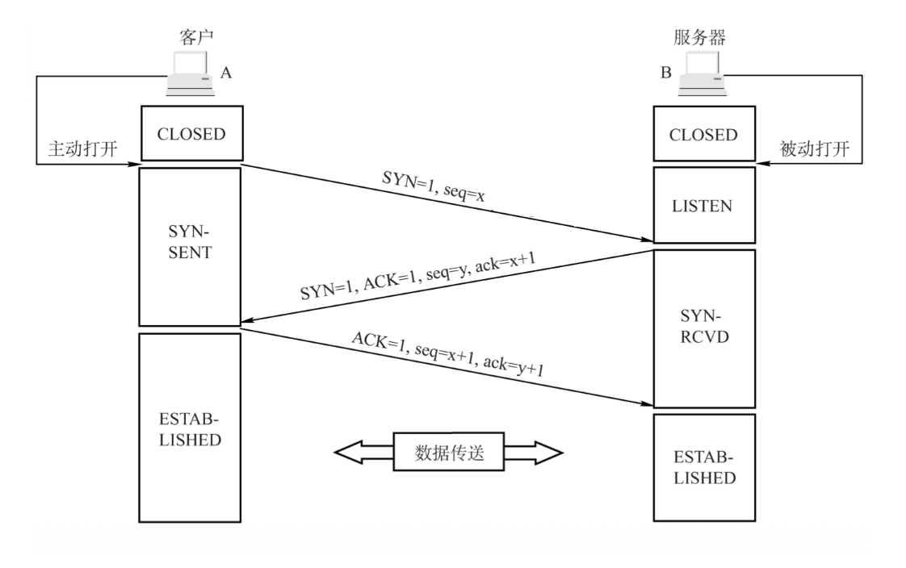

- SYN：连接请求/接收报文段
- seq:发送的第一个字节的序号
- ACK:确认报文段
- ack:确认号:希望收到的下一个数据的第一个字节的序号

**刚开始客户端处于Closed的状态，而服务端处于Listen状态**
> CLOSED：没有任何连接状态
> LISTEN:监听来自远方TCP端口的连接请求

#### 为什么要三次握手?
三次握手的目的是为了建立可靠的通信信道，最主要的目的就是**双方确认自己与对方的发送和接收是否是正常的**。

- 第一次握手(客户端发送SYN报文给服务器，服务器接收该报文)，
   - 客户端什么都不能确认，服务器确认了对方发送正常，自己接收正常。
- 第二次握手(服务端响应SYN报文给客户端，客户端接收该报文):
   - 客户端确认了:自己发送、接收正常，对方发送、接收正常
   - 服务器确认了:对方发送正常，自己接收正常。
- 第三次握手:(客户端发送ACK报文给服务器)
   - 客户端确认了:自己发送、接收正常，对方发送、接收正常。
   - 服务器确认了：自己发送、接收正常，对方发送、接收正常。
#### ISN是固定的吗?
三次握手的其中一个重要的功能就是让客户端和服务端交换ISN，以便让对方知道接下来接收数据的时候如何按照序列号组装数据。
**如果ISN是固定的，攻击者就很容易知道后续的确认号，因此ISN是动态生成的。(这里的ISN指的就是建立连接时候发送的seq)**
#### 三次握手过程中可以携带数据吗？
第三次握手的时候，是可以携带数据的。但是，**第一次，第二次握手绝对不可以携带数据。**
假如第一次握手可以携带数据的话，如果有人要恶意举报攻击服务器，那么他都在第一次握手的SYN报文中放入大量数据，然后疯狂重复发送SYN报文的话，这会让服务器花费很多时间、内存空间来接收这些报文。
而对于第三次而言，此时客户端已经处于建立状态，对于客户端来说，他已经建立起连接了，并且也已经知道服务器的接收、发送能力是正常的，所以当然能够正常发送/携带数据罗。
#### 半连接队列
服务器第一次收到客户端的SYN之后，就会处于半连接状态，此时双方还没有完全建立其连接，服务器会把这个状态下的请求连接放到一个队列中，我们把这种队列称之为**半连接队列**。
当然还有一个全连接队列，完成三次握手后建立起的链接就会放在全连接队列中，如果队列满了就有可能会出现丢包现象。
#### 如果第三次握手丢失了，客户端服务端会如何处理
服务器发送完SYN-ACK包，如果未收到客户端响应的确认包，即第三次握手丢失，那么**服务器就会进行首次重传，若等待一段时候仍为收到客户端确认包，就会进行第二次重传，如果重传次数超过系统规定的最大重传次数，则系统就会将该连接信息从半连接队列中删除。**
#### SYN洪泛攻击
SYN攻击就是Client在短时间内伪造大量不存在的IP地址，并向Server不断发送SYN包，Server则回复确认包，并等待Client确认，由于源地址不存在，因此Server需要不断重发直至超时，由于这些伪造的SYN包将长时间占用半连接队列，导致正常的SYN请求因为队列满而被丢弃，从而引起的网络拥塞甚至系统瘫痪。
### TCP四次挥手释放连接
建立一个TCP连接需要三次握手，而终止一个TCP连接要经过四次挥手,这是由于TCP的**半关闭**特性造成的。TCP提供了连接的一端在结束它的发送后还能接收另一端数据的能力。
TCP连接的释放需要发送四个包，因此称为四次挥手，**客户端或者是服务端均可主动发起挥手动作。**

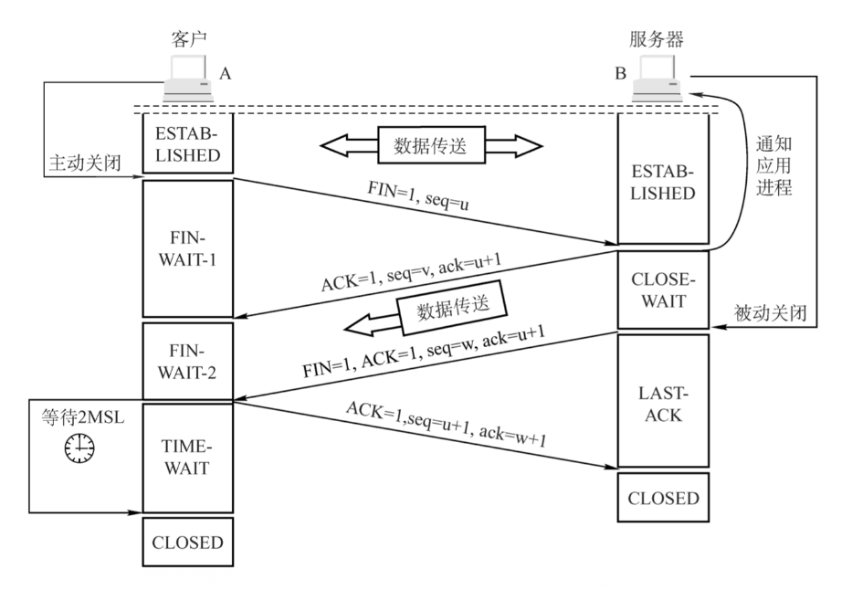

- FIN：连接终止位
- seq:发送的第一个字节的序号
- ACK：确认报文段
- ack:确认号，希望收到的下一个数据的第一个字节的序号。
1. 第一次挥手:客户端发送了一个FIN报文（请求连接终止:FIN=1），报文中会指定一个序列号seq=u,并**停止再发送数据**，**主动关闭TCP连接**，此时客户端处于FIN_WAIT1状态，等待服务端确认。
2. 第二次挥手：服务端收到FIN之后，会发送ACK报文，且把客户端的序列值+1作为ACK报文的序列号值，表明已经收到客服端的报文了，此时服务端处于CLOSE_WAIT状态。
> CLOSE_WAIT-等待从本地用户发起的连接中断请求。

**此时的TCP处于半关闭状态，客户端到服务端的连接释放。**客户端收到服务端确认后，进入到FIN_WAIT2(终止等待2）状态，等待服务端发出的连接释放报文段。

3. 第三次挥手：如果服务端也想要断开连接了,和客户端的第一次挥手一样，发送FIN报文，且指定一个序列号，此时服务端出于LAST_ACK的状态，等待客服端确认。
4. 第四次挥手:客户端收到FIN之后，一样发送一个ACK报文作为应答(ack=w+1)，且把服务端的序列值+1作为自己ACK报文的序列号(seq=u+1)，此时客服端处于时间等待状态.
> 注意，这个时候由服务端到客户端的TCP连接并没有释放掉，**需要经过时间等待计时器设置的时间2MSL(一个报文的来回时间)后才会进入到CLOSE状态**，这样做的目的是为了确保服务端可以收到自己的ACK报文，如果服务端在规定时间内没有收到自己的ACK报文，如果服务端在规定时间内没有收到客服端发来的ACK报文的话，服务端就会重新发送FIN报文给客服端，客户端再次收到 FIN 报文之后，就知道之前的 ACK 报文丢失了，然后再次发送 ACK 报文给服务端）。服务端收到 ACK 报文之后，就关闭连接了，处于 CLOSED 状态。

### TCP的可靠传输保证
#### TCP可靠传输概览
**可靠传输就是保证接收方收到的字节流和发送方发出的字节流是完全一样的**。
网络层是没有可靠传输机制的，尽自己最大的努力进行交付，而传输层使用TCP实现可靠传输，TCP保证了可靠传输的机制有如下几种:

1. 校验和Checksum(不是很重要，我不看了)
2. 序列号和确认应答机制
3. 重传机制
4. 流量控制(滑动窗口协议)
5. 拥塞控制
#### 序列号和确认应答机制
确认应答机制就是接收方收到TCP报文段之后就会返回一个确认应答消息。
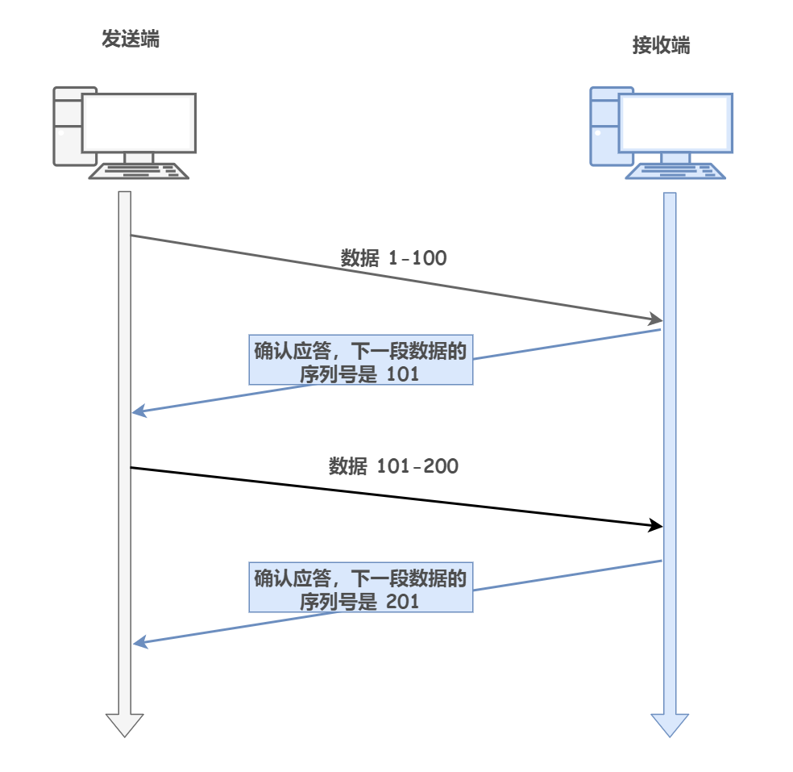
#### 重传机制
通常来说报文的丢失是暂时的，因此TCP能够发现和恢复报文丢失显得尤为重要。
重传机制是TCP最基本的错误恢复功能。常见的重传机制有:

- 超时重传
- 快速重传
##### 超时重传
超时重传就是TCP发送方在发送报文的时候，设定一个定时器，如果在规定时间内没有收到接收方发送过来的ACK确认报文，发送方就会重传这个已经发送的报文段。
对于发送方没有正确接收到接收方发来的ACK确认报文的情况，有以下两种:

- 第一种情况:报文段丢失

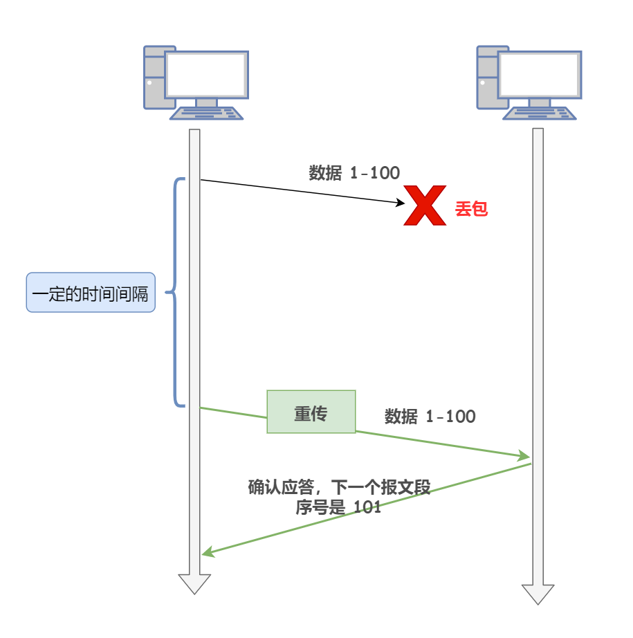

- 第二种情况:接收方的ACK确认报文丢失

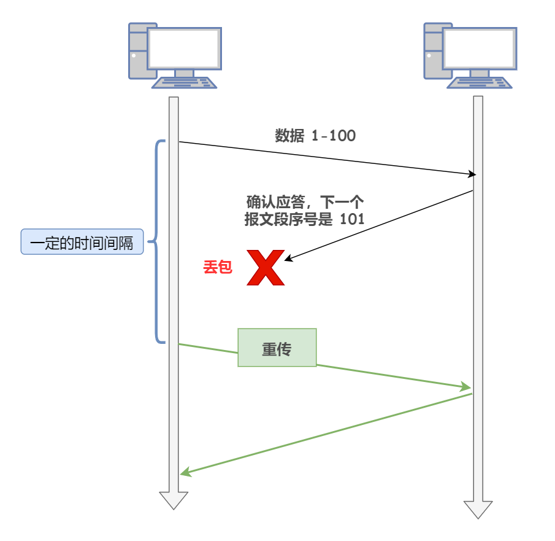
超时重传时间我们一般设置为**RTO**,首先，在此之前，我们先了解一下RTT:**数据从网络一段传送到另一端所需的时间，也就是报文段的往返时间**，显然，**超时重传时间RTO的值应该略大于报文往返RTT的值**:
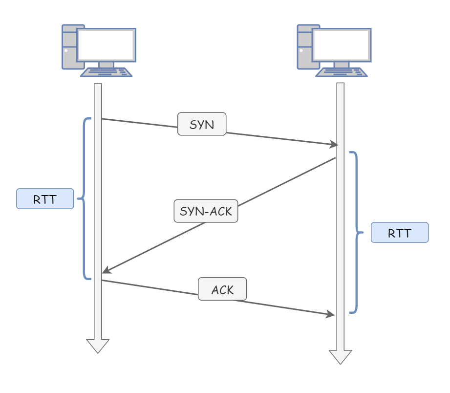

- RTO远大于RTT:网络的空闲时间增大，降低了网络传输的效率
- RTO小于RTT:不必要的重传，导致网络负荷增大。
> 如果超时重传的数据又超时了该怎么办?TCP的策略是重传的时间间隔加倍，也就是说，每进行一次超时重传，都会将下一次重传的超时时间间隔设置为先前值的两倍。

##### 快速重传
超时重传存在的问题就是，超时周期可能相对较长，于是快速重传产生了。
**快速重传机制不以时间为驱动，而是以数据驱动重传**。每当接收方收到比期望序列号大的失序报文到达时，就会向发送方发送一个**冗余ACK**，指明下一个期待的字节的序号。
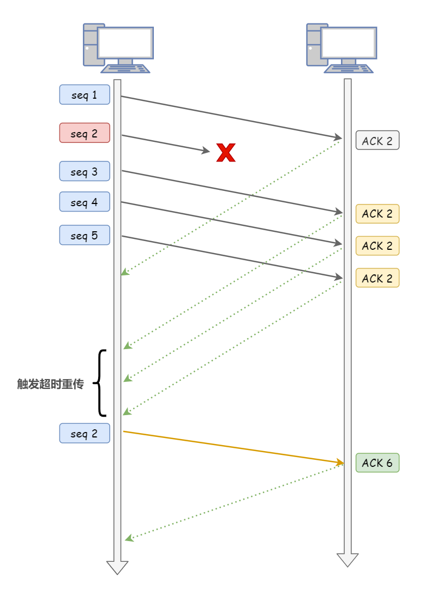
#### 滑动窗口协议
##### 累积确认
其实只有收到了上一个报文段的确认应答后才能发送下一个报文段这种模式效率非常低下，每个报文段的往返时间越长，网络的吞吐量就越低，通信的效率就越低，为此，TCP引入了**窗口**的概念，窗口大小就是指**无需等待确认应答，可以连续发送数据的最大值**
> 窗口的实现实际上就是操作系统开辟的一个**内核缓冲区**，发送方在等待确认应答报文返回之前，必须在缓冲区保留已经发送的数据，如果在规定时间间隔内收到了确认应答报文，就可以将数据从缓冲区中清除。

举个例子：假设窗口大小为3个TCP端，那么发送方就可以连续发送3个TCP端(100-199,200-299,300-399)，这样，接收方就会产生对应的3个确认应答，即使其中一个比如第二个确认应答ACK300也丢失了，也没有关系，只要第三个确认应答ACK400正确收到了，那就意味着第400字节之前的所有数据接收方都接收到了，这个模式就叫做**累积确认**或者**累积应答**。
##### 发送方的滑动窗口
发送方的窗口，根据处理的情况分成四个部分:

- 已发送并收到ACK确认应答的数据
- 已发送但未收到ACK确认应答的数据
- 未发送但是总大小在接收方处理范围内的数据
- 未发送但是总大小超过接收方处理范围的数据

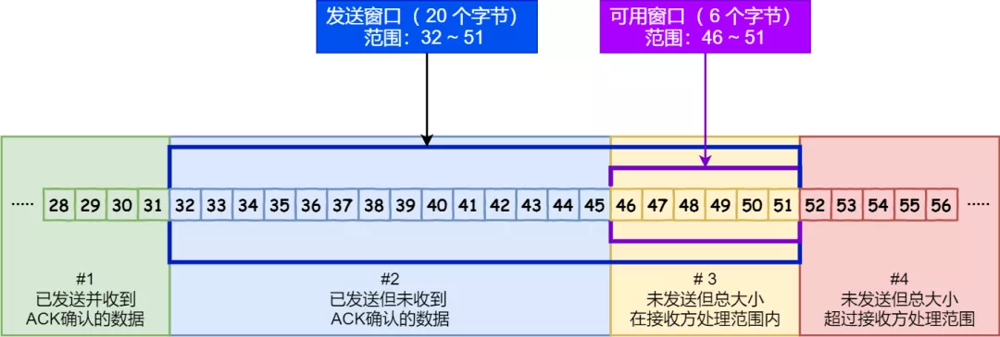
当发送方把数据全部发送出去之后，可用窗口的大小就是0了，表明可用窗口耗尽，在没有收到ACK确认之前无法继续发送数据。
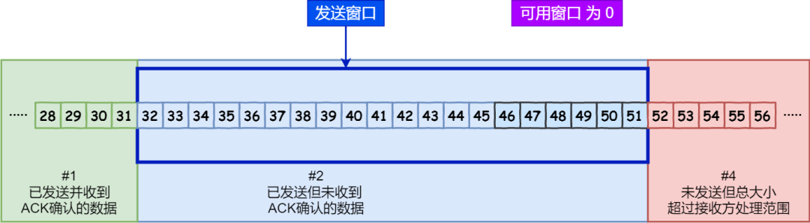
当收到之前发送的数据32~36字节的ACK确认应答之后，如果发送窗口的大小没有变化，则**滑动窗口往右边移动5个字节，因为有5个字节的数据被确认应答**，接下来52~56字节又变成了可用窗口，那么后续就可以发送52~56这5个字节的数据了。
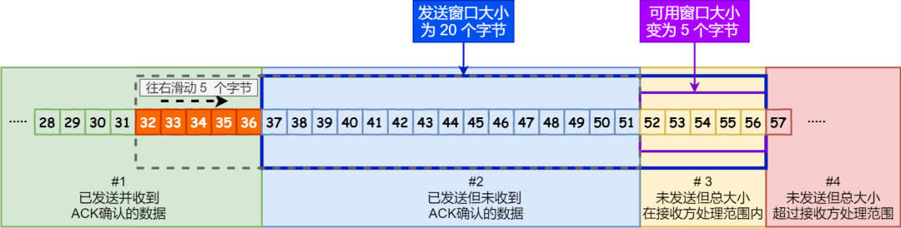
##### 接收方的滑动窗口
接收方的滑动窗口可以分成三个部分：

- 已成功接收并确认的数据
- 未收到数据但是可以接收的数据
- 未收到数据且不可以接收的数据（超出接收方窗口大小）

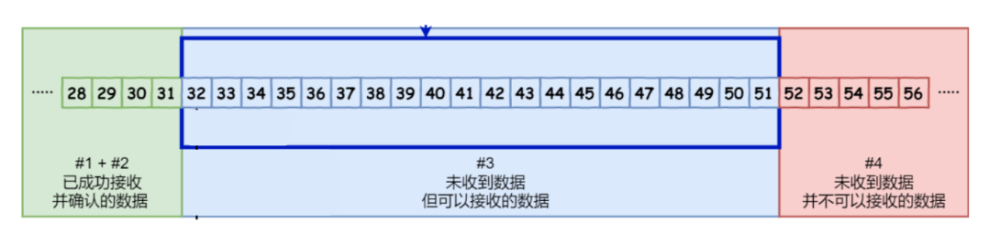
#### 流量控制
**所谓流量控制就是控制发送方发送速率，保证接收方来得及接收。**
**TCP实现流量控主要就是通过滑动窗口协议。**
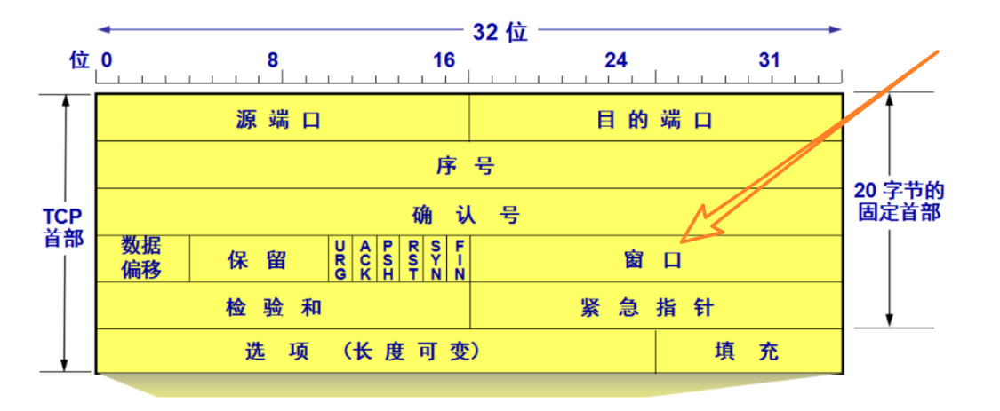
该字段的含义就是**接收缓冲区的剩余大小**，于是发送端就可以根据这个接收端的处理能力来发送数据，而不会导致接收端处理不过来。所以，通常**窗口大小是由接收方来决定的**。
> 接收端会在发送ACK确认应答报文时，将自己的即时窗口大小填入，并跟随ACK报文一起发送出去，而发送方根据接收到的ACK报文中的窗口大小的值改变自己的发送速度，如果接收到窗口大小的值为0，那么发送方就会停止发送数据，并定期的向接收端发送窗口探测数据端，提醒接收端把窗口大小告诉发送端。

#### 拥塞控制
在某段时间，对网络中某一资源的需求超过了该资源所能够提供的可用部分(即**需大于供**)网络的性能变差。如果网络出现拥塞，TCP报文可能会大量丢失，此时就会大量触发重传机制，从而导致网络拥塞程度更高，严重影响传输。
> 其实只要发送方没有在规定时间内接收到ACK应答报文，也就是触发了重传机制，就会认为网络出现了拥塞。

因此当出现拥塞时，应当控制发送方的速率。这和流量控制很像，但是**出发点不同**。
为了调节发送方所要发送的数据的量，定义了**拥塞窗口**的概念**，**拥塞窗口时发送方维护的一个状态变量，它会根据网络的拥塞程度动态变化。

- 只要网络中出现了拥塞，拥塞窗口就会减少。
- 若网络中没有出现拥塞，拥塞窗口就会增大，。

TCP的拥塞控制采用了四种算法:

- 慢开始
- 拥塞避免
- 快重传
- 快恢复
##### 慢开始
TCP在刚建立连接完成之后，如果立即把大量数据注入到网络中，那么很有可能会引起网络拥塞，好的方式是先探测一下，一点一点提高发送数据包的数量，即由小到大逐渐增大，**拥塞窗口初始值是1，每经过一次传播轮次，拥塞窗口就会加倍(指数增长)**
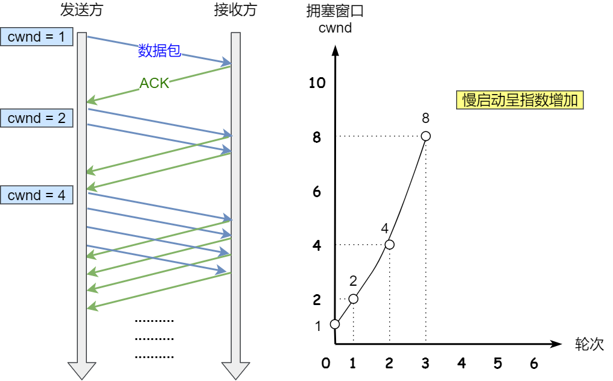
当然，不能一直执行慢启动，这里会设置一个**慢启动轮限**状态变量:

- 当拥塞窗口<慢启动轮限时候，继续使用慢启动算法。
- 如果拥塞口>=慢启动轮限，开始使用拥塞避免算法。
##### 拥塞避免
拥塞避免算法的思路就是让拥塞窗口缓慢增大，即每经过一个往返时间，拥塞窗口+1
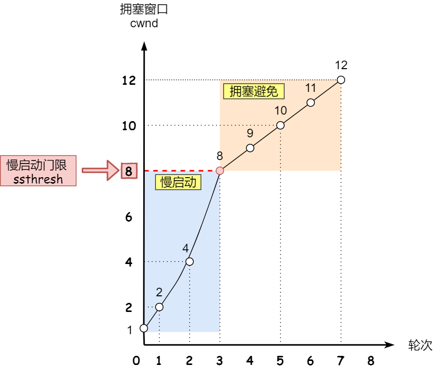
无论是慢开始还是拥塞避免，只要出现了网络拥塞(触发超时重传机制)，慢开始轮限sshresh和拥塞窗口大小就会发生变化

- 轮限设置为拥塞窗口大小的一半
- 拥塞窗口设置为1

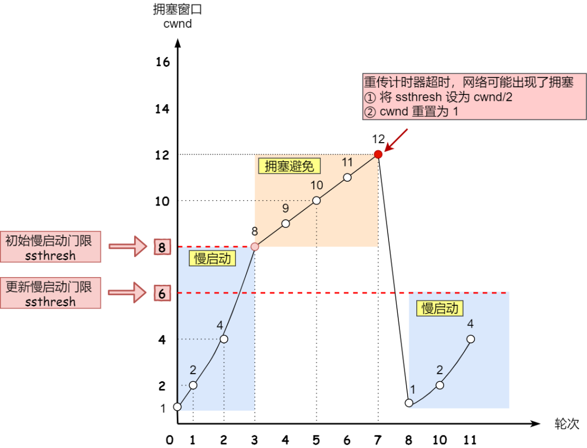
##### 快重传和快恢复
快速重传和快速恢复算法一般同时使用。
当触发快速重传机制，即接收方收到三个重复的ACK确认的时候，就会执行快重传算法,发送方会立即重传丢失的数据包。
具体来说快速恢复的主要步骤就是:

- 把拥塞窗口设置为轮限的值加3，然后重传丢失的报文段(加3的原因就是因为收到了3个重复的ACK,表明有3个老的数据包离开了网络)
- 如果再收到重复的ACK,拥塞窗口大小+1
- 如果收到的新的数据包ACK时，把拥塞窗口设置为第一步中的轮限的值，原因是因为该ACK确认了新的数据，说明从重复ACK时的数据都已经收到了，该恢复过程已经结束，可以回到恢复之前的状态。
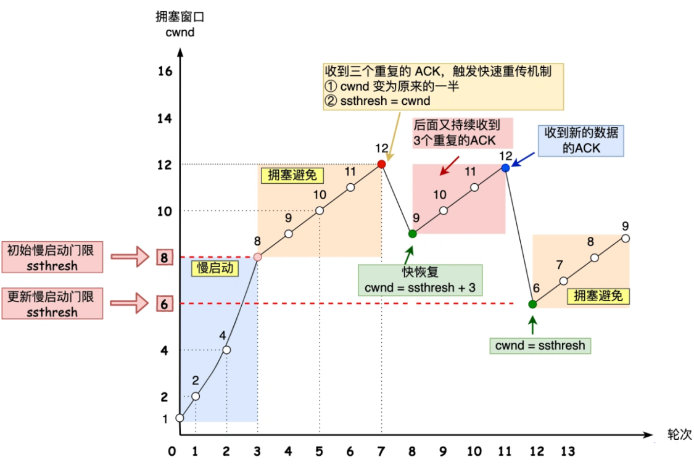
