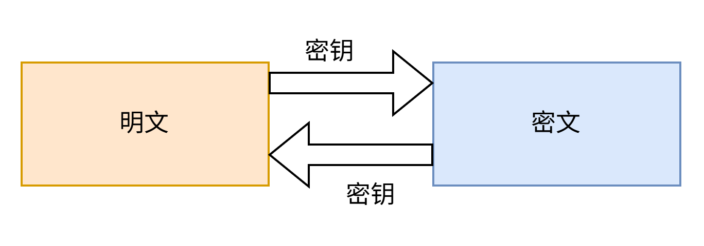
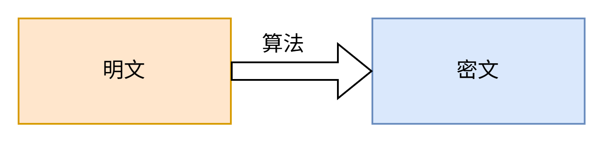

## 对称算法分类
### 对称加密

常见算法：DES、3DES

优点：加密，解密速度快，适合对大数据量进行加密

缺点：在网络中需要分发密钥，增加了密钥被窃取的风险
### 非对称加密

常见算法：RSA，DSA

优点：安全（私钥仅被一方保存，不用于网络传输，私钥永远保存在服务器，服务
器将公钥发送给客户端）

缺点：仅一方能够解密
### 摘要/哈希/散列

常见算法：MD4，MD5，SHA1

优点：密文占用空间小（定长的短字符串）；难以被破解

缺点：无法解密

