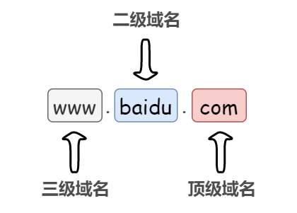
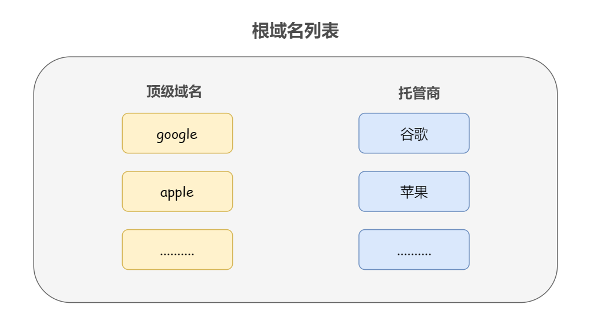
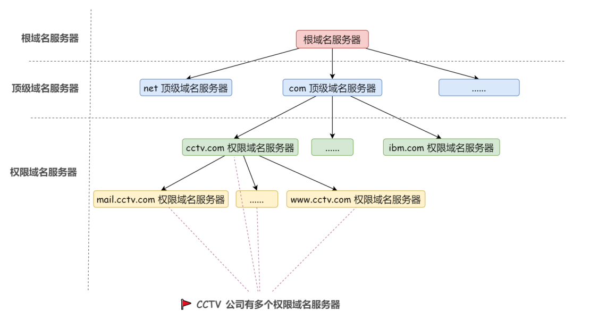
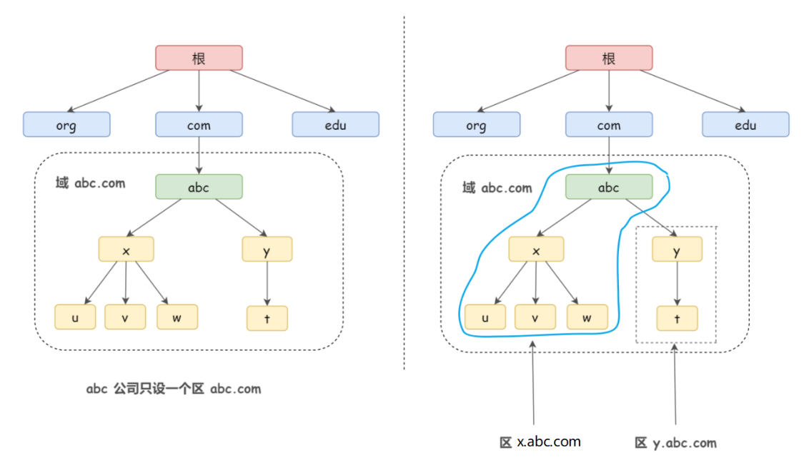
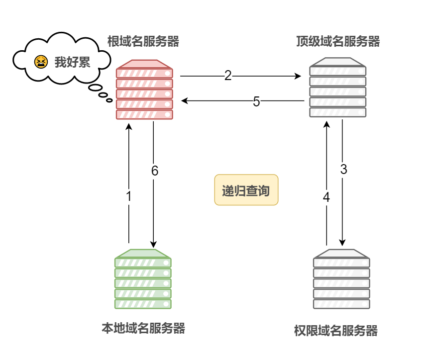
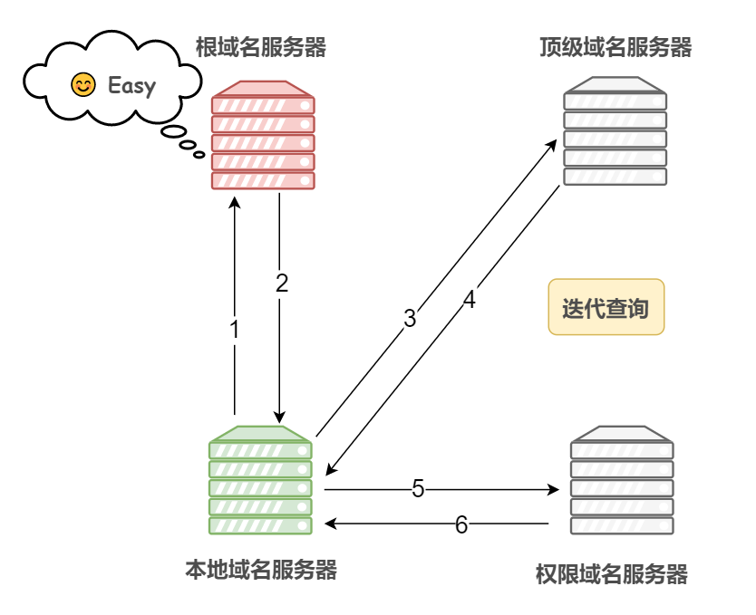

## 什么是DNS协议？
- **IP地址**:一长串能够唯一地标记网络上计算机的数字
- **域名**:又称为网域，是由一串用点分隔的名字组成的Internet上的某一台计算机或者计算机组的名称，用于在数据传输时对计算机的定位标记
> 网址和网域的区别:网址中含有域名，www.gitee.com/veal198就是一个网址，而www.gitee.com就是域名

由于IP地址具有不方便记忆并且不能显示地址组织的名称和性质等缺点，人们设计出了域名，并通过域名解析协议DNS来将域名和IP地址相互映射。
> DNS协议可以使用UDP或者TCP进行传输，使用的端口号都是53，但是大多数情况下DNS都可以使用UDP进行传输。

## 域名详解
**ICANN负责全世界域名系统的运作**
域名其实是具有一定的层次结构的，从上到下依次为**:根域名、顶级域名、二级域名、三级域名等。**

### 根域名
为什么没有看到根域名？在有些场合下，比如www.xxx.com被写成www.xxx.com.最后面还会多出来一个点，这个点就是表示根域名。
理论上，**所有根域名的查询都必须先查询根域名，**因为只有根域名才能告诉你，某个顶级域名由哪台服务器管理。**ICANN维护着一张列表(根域名列表)，里面记载着顶级域名和对应的托管商。**

由于根域名列表很少变化，大多数DNS服务商都会提供它的缓存，所以根域名的查询事实上不是那么频繁。
## 域名服务器详解
域名服务器是指管理域名的主机和相应的软件，它可以管理所在分层的域的相关信息，一个域名服务器所负责管理的分层叫做区，域名的每层都设有一个域名服务器。

- 根域名服务器
- 顶级域名服务器
- 权限域名服务器

> 除了上面的三种DNS服务器，还有一种不在DNS层次结构中，但是很重要的NDS服务器，即**本地域名服务器**

### 根域名服务器
根域名列表，里面记载着顶级域名和对应的托管商，其实根域名列表的正式名称是DNS**根区，**保存DNS根区文件的服务器，就叫做DNS根域名服务器，根域名服务器保存所有顶级域名服务器的地址,
所以一般来说所有的域名服务器都会注册一份根域名服务器的IP地址的缓存，用于在必要的时候向其发送请求。
### 顶级域名服务器
**管理注册在该顶级域名下的所有二级域名**的，**记录这些二级域名的IP地址**
### 权限域名服务器
如果一个二级域名或者一个三级/四级域名对应一个域名服务器，则域名服务器的数量会很多，我们需要使用**划分区**的办法来解决这个问题，那么权限域名服务器就是负责管理一个**区**的域名服务器。
**什么是区?怎么划分区的?**
区和域其实是不同的，区可以有多种不同的划分方法，以百度为例，我们假设有fanyi.baidu.com、ai.baidu.com、tieba.baidu.com这三个域名，我们可以这样划分区，fanyi.baidu.com和tieba.baidu.com放在baidu.com这权限域名服务器。ai.baidu.com放在ai.baidu.com权限域名服务器重，并且baidu.com权限域名服务器和ai.baidu.com权限域名服务器是同等地位的。

### 本地域名服务器
也称之为权威域名服务器,本地域名服务器是电脑解析时的默认域名服务器，姐电脑中设置的首选DNS服务器和备选DNS服务器，常见的有电信、联通、谷歌、阿里等本地DNS服务。
**每一台主机发出DNS查询请求时，这个查询请求报文都会发送给该主机的本地域名服务器，本地域名服务器管理本地域名的解析和映射，并且能够向上级域名服务器进行查询。**
## DNS查询方式
具体DNS查询的方式有两种:

- 递归查询
- 迭代查询

所谓递归就是，如果请求的接受者不知道所请求的内容，那么接受者就会扮演请求者，发出有关请求，直到获取到所需要的内容，然后将内容返回给最初的请求者。
> 通俗来说，在递归查询中，如果A请求B,那么B作为请求的接收这一定要给A想要的答案，而迭代查询则是指，如果接受者B没有请求者A所需要的准确内容，接受者B将会告诉A，如何去获取到这个内容，但是自己并不去发出请求。

一般来说，**域名服务器之间的查询使用迭代查询方式，以免根域名服务器的压力过大**

1. **递归查询**

2. **迭代查询**

## 域名缓存
每次都要去访问本地域名服务器去获取IP地址显然是不实际的，解决方法就**使用缓存保存域名和iP地址的映射。**

1. 浏览器缓存：浏览器在获取网站域名的实际IP地址后会对其进行缓存，减少网络请求的损耗，每种浏览器都有一个固定的DNS缓存时间，如Chrome的过期时间是1分钟，在这个期限内不会重新请求DNS。
2. 操作系统缓存：操作系统缓存其实就是用户自己配置的hosts文件。

**主机和本地域名服务器之间的查询方式是递归查询**
## 完整域名解析过程

1. 首先搜索浏览器的DNS缓存，缓存中维护着一张域名和IP地址的对应表。
2. 如果没有命中，则继续搜索操作系统的DNS缓存。
3. 如果仍然没有命中，则操作系统就会将域名发送至本地域名服务器，本地域名服务器回查询自己的DNS缓存，查找成功则返回结果(注意：主机和本地域名服务器之间的查询方式是递归查询）
4. 如果本地域名服务器的DNS缓存没有命中，则本地域名服务器就会向上级域名服务器进行查询，通过以下方式进行**迭代查询，防止根域名服务器压力过大。**
   1. 首先本地域名服务器会向**根域名服务器**发起请求，根域名服务器是最高层次的，它并不会直接指明这个域名对应的IP地址，而是返回顶级域名服务器的地址，也就是说给本地域名服务器指明去哪一台DNS服务器寻找答案。
   2. 本地域名服务器拿到这个**顶级域名服务器**的地址之后，就向其发起请求，获得**权限域名服务器的**地址**。**
   3. 本地域名服务器根据域名服务器地址向其发起请求，最终获取到该域名对应的IP地址
5. 本地域名服务器将得到的IP地址返回给操作系统，同时自己将IP地址还存起来。
6. 操作系统将IP地址返回给浏览器，同时自己也将IP地址缓存起来。
7. 至此，浏览器就得到了域名对应的IP地址，并将IP地址缓存起来。
## 为什么DNS协议只使用了UDP?真的只使用了UDP吗?
DNS并非只使用了UDP协议，它**同时占用了UDP和TCP的53端口**，作为单个应用层协议，DNS同时使用两种传输协议也属实是一个另类了。
### DNS为什么同时使用TCP和UDP?

1. TCP需要三次握手建立连接，四次挥手释放连接；UDP不需要，面向无连接。
2. TCP首部需要20个字节，而UDP首部只有8个字节。
3. TCP具有一系列保证可靠传输的机制，而UDP尽最大努力交付，不提供可靠传输的机制，如果在数据传输的过程中出现了部分数据丢失，UDP协议本身并不能做出任何检测或者补救措施。
4. 正是由于UDP没有了可靠传输机制，所以速度远快于TCP，在某些情况下UDP是一种最有效的工作方式，一般用于即时通信，比如：语音电话、直播等等，而TCP一般用于文件传输、发送和接收邮件，远程登录等精准性要求比较高的场景。

上面这些都是最基本的，主要说的是**TCP是面向字节流的，而UDP是面向报文的**。
所谓UDP面向报文，发送方的UDP对应用层交付下来的HTTP报文，在添加UDP首部后也就是封装成UDP报文，就向下交付网络层IP协议，不做任何拆分和合并，主要就是因为UDP没有像TCP一样的序列号机制来标识报文，所以默认只要一个UDP报文。
UDP这么做就会导致一个问题。
互联网上物理链路层的最小传输单位=576字节，为了在物理链路层上顺利传输，UDP报文不能超过576字节，为此，**UDP报文被限制在512字节内**，而UDP报文由于大面积使用了UDP，这样一旦DNS报文超过512字节，基于UDP的DNS报文就只有抛弃多出来的64字节，截短为512字节，那么用户得到的DNS报文就是不完整的。
如何解决这个问题?
没错，最简单的方式就是使用TCP，尽管速度可能相之UDP较慢，但是对于得到完整的DNS报文，速度慢一点也可以忍受。
## DNS分别在什么情况下使用UDP和TCP
DNS协议关于UDP和TCP的选择通常可以分为以下两种情况:

1. 如果客服端事先知道DNS响应报文的长度会大于512字节，则应当直接使用TCP建立连接。
2. 如果客服端事先不知道DNS响应报文长度，一般先使用UDP协议发送DNS查询报文，若DNS服务器发现DNS响应报文长度大于512字节，则多出来的部分就会被UDP抛弃，那么服务器就会把这个部分被抛弃的DNS报文首部的TC标志为1，以通知客服端该DNS报文已经被截断，客服端收到之后就会重新发起一次TCP请求，从而使得它将来能够从DNS服务器收到完整的响应报文。当然了，在域名解析的时候，一般返回的DNS响应报文都不会超过512字节，用UDP传输即可，事实上，很多DNS服务器进行配置的时候，也仅支持UDP查询包。
> 不过，DNS不仅存在域名解析的过程，还有区域传输的过程，而在进行区域传输的时候DNS还会强制使用TCP协议。

什么是区域传输?
这就不得不提一下**主域名服务器和辅助域名服务器**了。
设置域名服务器的时候，服务器管理员可以选择将域名服务器指定为主服务器还是辅助域名服务器(也被称为从服务器)
主域名服务器负责维护一个区域所有的域名信息，是特定的所有信息的权威信息源，数据可以修改，主服务器直接从本地文件获取此信息，只能在主服务器上更改区域的DNS记录，然后在主服务器才能更新辅助服务器。
当主域名服务器出现故障、关闭或者负载过重的时候，辅助域名服务器作为主域名服务器的备份提供域名解析服务，辅助域名服务器中的区域文件中的数据时从主域名服务器中复制过来的，无法自行修改。
其实就是主从的概念，主域名服务器用来写，辅助域名服务器用来读，**提供负载均衡的能力，缓解主域名服务器的压力。**
**所谓区域传输，就是辅助域名服务器与主域名服务器通信，并同步数据信息的过程。**
辅域名服务器会定时向主域名服务器进行查询以了解数据是否有变动，如果有变动，则会执行一次区域传输，区域传输使用的TCP而不是UDP,因为**数据同步传送的数据量比一个DNS请求和响应报文的数据量要多得多。**
**既然UDP更快，为什么HTTP不使用UDP呢?**
由于互联网的不安全性，我们需要数字证书并携带数字签名来保证数据的安全性，为此，整个HTTP报文的大小已经远远超过512字节，无法使用UDP传输。
## 区分URL和URI
URI(统一资源标识符)
URL(统一资源定位符)，就是我们使用web浏览器访问web页面时候需要输入的网页地址.
URI就是某个协议方法表示资源的定位标识符，比如说，采用HTTP协议的时候，协议方案就是http，除此之外，还有ftp、telnet等
URL是URI的子集
### HTTP的缺点

- 通信使用明文(不加密）,内容可能被窃听。
- 不验证通信对方的身份，因此有可能遭遇伪装。
- 无法证明报文的完整性，所以有可能被篡改。

所以HTTPS应运而生，**HTTP+加密+认证+完整性保护就是HTTPS协议**
## 地址栏输入URL，回车后发生了什么?
应用层:

- 浏览器封装HTTP请求报文
- DNS解析域名获取到目标服务器地址

传输层:

- 建立连接
- 把应用层传过来的HTTP请求报文进行分割，并在各个报文上打上标记序号以及端口号转发给网络层。

网络层:

- 利用ARP协议根据IP地址获取作为通信目的地的MAC地址后转发给链路层。

服务端在链路层收到数据，按序往上层发送，一直到应用层接收到浏览器发送来的HTTP请求报文，然后处理该请求并返回HTTP响应报文，浏览器接收到响应报文之后解析渲染界面。
## DHCP协议
### 定义
**一台笔记本电脑，每移动到一个地方，就需要重新配置IP地址。**显然，手动分配IP地址不是我们人类中的那些顶级大脑能够做出来的事情，为了实现自动分配IP地址，统一管理IP地址分配,DHCP协议(动态主机配置协议)就被创造出来了，这是一个应用层协议。
在提供DHCP服务的网络中，管理员的负担大幅度减轻，只要在DHCP服务器上做一些必要的设置即可，计算机一旦接入到网络，就会自动获取到TCP/IP通信所必须的设置，并且DHCP服务器保证其IP地址的唯一性。
### DHCP工作原理
DHCP不仅可以为接入互联网的计算机配置IP地址，还可以配置子网掩码，默认路由等信息，这些都需要提前配置到DHCP服务器上。
从DHCP获取IP地址的流程和ARP有一点相似，不过还是存在不同的，客服端主机和DHCP服务器之间基于UDP协议采用广播形式进行交互，主机发送请求到DHCP服务器的67号端口，DHCP服务器回应应答消息给主机的68号端口。具体流程如下:

1. **客服端主机广播包**DHCP Discover包:主机请求DHCP服务器为自己设置IP地址，子网掩码等信息
2. **DHCP服务器广播包 **DHCP Offer包:DHCP服务器通知主机哪些网络设置是可以使用的。如果这个网络中存在多个DHCP服务器，它们都知道了客服端在进行广播，那么这个客服端就会收到多个可用的IP地址等信息。
3. **客服端广播包 **DHCP ACK包:主机在它收到的多个Offer中，选择其中一个，一般都是最先到达的那个，并且会向网络广播一个DHCP Request包，包中包含了客服端主机的MAC地址，接受的Offer的IP地址，提供此Offer的DHCP服务器地址等，并告诉所有DHCP服务器，它将要接受哪一台服务器提供的IP地址，告诉其他的DHCP服务器，撤销它们提供的IP地址，以便提供给下一个IP租用请求者。
4. **DHCP服务广播包 **DHCP ACK包：在完成(4)步之前，主机还没有得到DHCP服务器的最后确认，所以它还没有IP地址，DHCP服务器想要给这个主机发送消息，仍然只能采用广播的形式，广播包中包含了分配给这台主机的IP地址等信息。至此，DHCP网络设置结束，可以进行正常的TCP/IP通信了。
> DHCP设置中通常都会有一个时间的限制，时间到了。**客服端主机可以在这个事件限之前，发送DHCP Request包通知想要延长租用时间即可**，另外，当客服端主机不再需要这个IP地址的时候，随时都可以通过发送DHCP Release报文释放自己的IP地址，DHCP服务器收到DHCP Release报文之后，会挥手相应的IP地址并重新分配。

### DHCP的三种机制

1. 自动分配方式，DHCP服务器为主机指定一个永久性的IP地址，一旦DHCP客服端第一次成功从DHCP服务器租用到IP地址之后，就可以永久性使用该地址。
2. 动态分配方式，DHCP服务器给主机指定一个具有时间限制的IP地址，时间到期或者主机明确表示放弃该地址的时候，该地址就可以被其他主机使用。
3. 手动分配方式：客服端的IP地址是由网络管理员指定的，DHCP服务器只是将指定的IP地址告诉客服端主机。
### DHCP服务器如何保证分配的IP地址不会冲突
为了避免冲突，DHCP服务器具备这样的功能:

- 在分配IP地址之前发送ICMP回送请求包，如果收到了返回回应报文，那么这个IP地址已经被人用了。

同样的，客服端主机也得确认一下DHCP服务器分配的IP地址是否正在被人使用：

- 针对从DHCP那里获得的IP地址发送ARP请求报文，如果收到了返回应答，也就是说这个IP地址都找到了对应的MAC地址，这说明不能再使用了。

