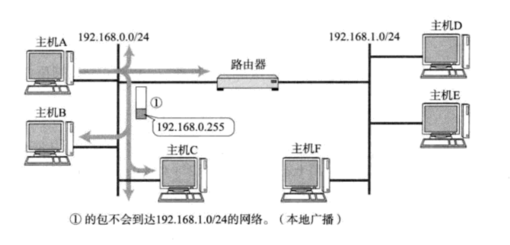
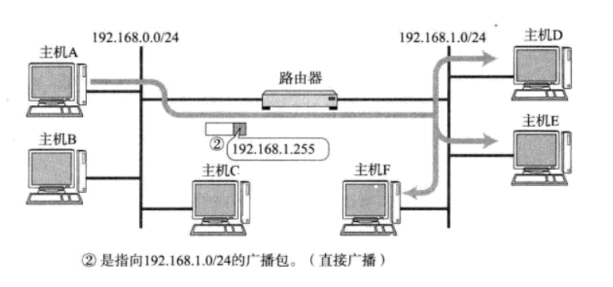
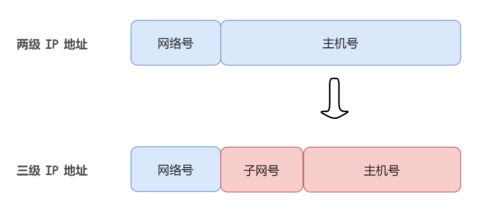
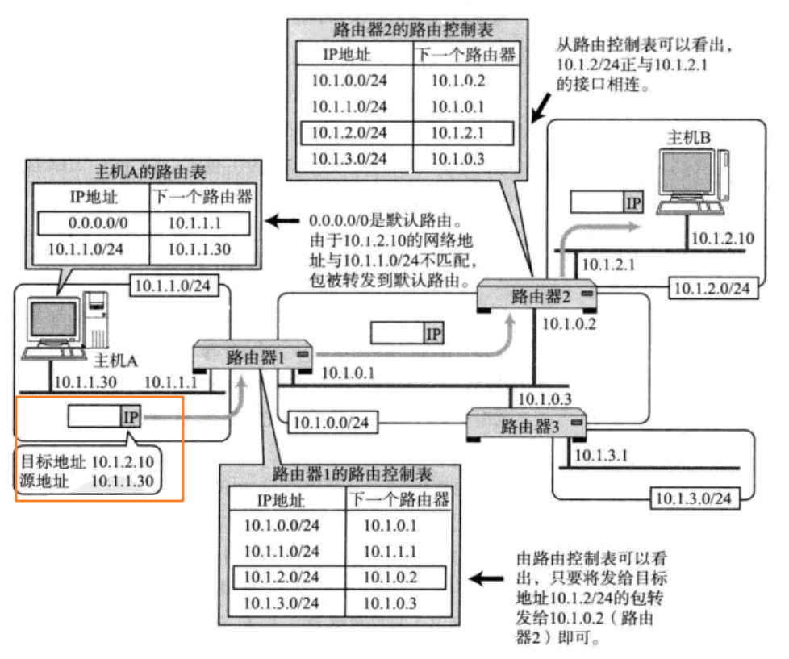
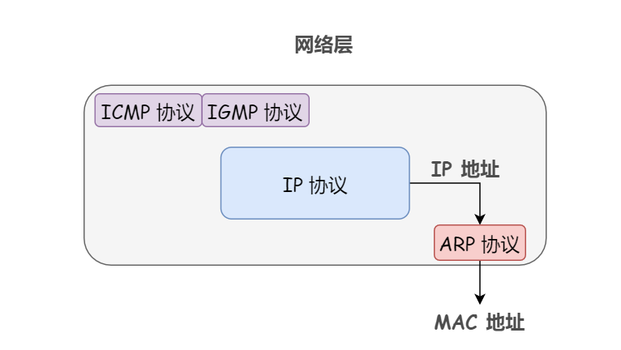
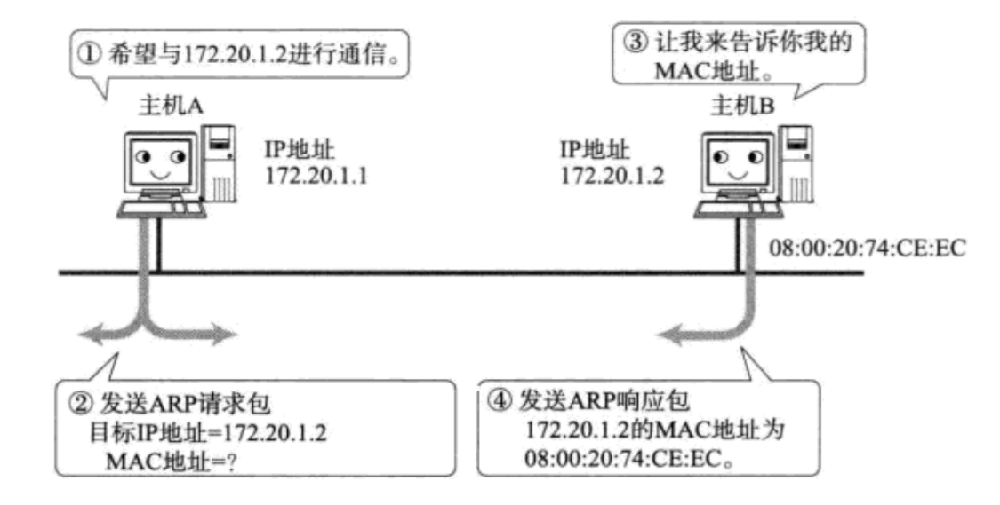

## 定义
> 网络层的任务就是选择合适的网间路由和交换结点，确保数据及时传送。
> 通俗来说，数据链路层的作用很简单，它是无脑的，只负责在两个相邻节点之间传送数据，它并不知道它传送的最终目的地是哪，而网络层便是它的大脑，网络层指定源地址和目的地址，并高速数据链路层该走哪条路。

## 什么是IP协议
IP协议是整个TCP/IP协议族的核心，位于TCP/IP模型的网络层，IP协议用于**屏蔽下层物理网络的差异，为上层提供统一的IP数据报**。

1. 无连接的投递服务：发送端可以再任何时候自由发送数据，而接收端永远不知道自己会在何时从哪里接收到数据，**一台主机发出的数据报序列，可能会走不同的路径**，甚至有的可能一部分数据报在传输过程中丢失。
2. 不可靠的投递服务：IP协议本身不保证IP数据报投递结果，在传输过程中，IP数据报可能会丢失、重复，延迟和乱序等，IP协议不对内容做任何检查，也不将结果通知收发双方。
3. 尽力投递服务：每个数据链路上会规定一个最大传输单元MTU，如果IP数据报的长度超过MTU，那么网络层就会把这个报文分割成为一个一个小组(分组)进行传送
## IP地址
### IP地址初探
IP数据报中含有收/发方的IP地址，使用点分十进制表示
### IP地址和MAC地址
在Internet中，MAC地址是全局唯一的，而IP地址只在局域网内是唯一的。

- IP地址并不是根据主机台数来配置的，而是根据网卡(网络适配器)来的。
- 源IP地址和目标IP地址在传输过程中是不会变化的，源MAC地址和目的MAC地址会不断发生变化。
> 在一个局域网中，IP地址可以使静态的，也可以是动态的，对于动态IP的分配，通常会使用DHCP协议，DHCP服务器会为每个连接到网络上的设备分配一个动态IP地址，这个IP地址的使用时间是有限的，当设备从网络中断开一段时间后，这个IP地址就会被释放，以供其他设备使用。

## IP地址的分类
为什么需要分离网络号和主机号?

- 如果网络地址相同，表示接收方在本网络上(本地网络主机)，那么可以把数据包直接发送到目的主机，无需转发给其他网络。
- 网络号不同的主机称之为远程网络主机，远程网络主机要相互通信必须要通过本地网关来传递转发数据。
### IP单播/广播/多播
#### 定义
广播地址用于在同一个链路中相互连接的主机之间发送数据包，即一个发送方对应多个接收方。
广播地址可以分为本地广播和直接广播两种：

1. 在本网络内广播的叫做本地广播

2. 在不同网络之间的广播叫做直接广播，例如网络地址为192.168.0.0/24的主机向192.168.1.255/24的目的地址发送IP包

> 🐔由于直接广播有一定的安全问题，多数情况下会在路由器上设置为不发广播包

#### IP单播
在单播模式下**，只有一个发送方和一个接收方**，单播是可以直接穿透路由器的。
#### IP多播
D类和E类IP地址是没有主机号的，所以不可以用于主机IP
多播使用D类地址，多播用于**将包发送给特定组内的所有主机(可以穿透路由器)，即一个发送方，特定的多个接收方**
> 在人们使用多播功能之前，一直采用广播的方式，通过广播将数据发送给所有终端主机，再由这些主机Ip之上的一层去判断是否有必要接收数据，这种方式会给那些毫无关系的网络或者主机带来影响，造成网络上不必要的流量。

## 子网划分
### 子网划分初探
为什么要进行子网划分，这是因为**传统的IP地址分类可能会造成资源浪费**

同样的，**子网主机号不能够全0或者全1**
> **注意：某单位划分子网之后，对外表现为一个网络，即本单位外的网络看不到本单位内的子网划分**

### 子网掩码
子网掩码只有一个作用，**就是将某个IP地址划分为网络地址和主机地址两部分。**
子网掩码由连续的1和0构成(0和1必须连续）
将某个局域网**IPv4地址与子网掩码进行与运算，就可以得到网络地址**
## 拯救枯竭的IPV4地址
### 无分类IP地址CIDR
人们开始放弃IP地址的分类，采用**任意长度分割IP地址的网络号和主机号**，这种方式叫做无分类IP地址CIDR(之前的A,B,C类地址都是网络号和主机号固定长度)
为什么CIDR的利用率高于分类IP?
> 使用CIDR的网络地址分配，我们可以采用一个更短的地址前缀，并利用可变长度子网掩码进行分配。例如，使用一个/22的前缀长度来分配这50个子网，而不是为每个子网分配一个C类地址。在这种情况下，50个子网所需要的IP地址总数为50×200 = 10000个IP地址。使用一个/22的前缀长度，可以获得一个地址块，其中包含1024个IP地址

### NAT地址转换
就是使用私有IP地址
## 路由控制
### 路由控制初探
为了将数据报发送给目的主机，所有主机和路由器都维护着一张**路由控制表**，该表记录着如下两个字段:

- IP地址
- 如果想要到达这个IP地址，在当前路由器，数据包的下一步应该是发送到哪个路由器。

在发送IP数据报时，首先要确定IP数据报首部中的目标地址，再从路由控制表中找到与该地址具有**相同网络地址**的记录，根据该记录将IP数据报转发给相应的下一个路由器，如果路由控制表中存在多条相同网络地址的记录，就现在相同位数最多的网络地址，也就是**最长匹配**。

什么是默认路由?

- 默认路由就是指路由表中任何一个地址都能与之匹配的记录，如果一张路由表中包含了所有的网络和子网信息，就会造成无端的浪费。

此外，我们还需要注意一个地址:环回地址，环回地址是同一台计算机上的程序之间在进行网络通信时使用的一个默认地址，当计算机使用这个特殊IP地址或者主机名时，**数据报就不会流向网络。**
### 路由协议
路由控制表的形成有两种方式:

- 一种是管理员手动设置，也叫做**静态路由控制**
- 另一种是路由器与其他路由器相互交换信息时自动刷新，也叫做冬天路由控制。

为了让动态路由即时刷新路由控制表，在网络上不良的路由器必须设置好某种协议，保证正常读取路由控制信息，这种协议就称为**路由协议**。
人们根据路由控制的范围将路由协议大致分为两类:

- 外部网关协议EGP(包含RIP，OSPF等协议)
- 内部网关协议IGP(包含BGP等协议)
> 没有EGP就不可能由世界上各个不同的组织机构之间的通信，没有IGP就不可能由机构内部的通信。

## ARP协议
### 为什么需要ARP协议?
**网络层实现了主机之间的通信，而链路层实现具体每段链路之间的通信。**
ARP就是实现由IP地址到MAC地址转化的一个网络层协议。

**在数据链路层每次换乘时，网络层为其购买了一张标有下一个MAC地址的车票，ARP协议做的事情就是在数据链路层每次换乘的时候，为其购买一张标有下一个MAC地址的车票。**
具体来说，网络层对数据链路层做出指引的过程被称为路由控制，指引数据链路层的下一站是哪，为了将数据报发送给目标主机，所有主机和路由器都维护了一张路由控制表，该表记录如下两个字段:

1. IP地址
2. 如果想要达到这个IP地址，在当前路由器，数据包的下一步应该是发送到哪个路由器。

**但是，在数据链路层进行通信的时候，它只认得MAC地址，所以，用来实现IP地址到MAC地址转换的ARP协议就显得尤为重要了。**
> ARP协议只适用于本局域网中，因为ARP协议需要使用广播进行通信，而路由器不会转发局域网广播包，所以ARP请求无法跨越路由器进行通信。但是，在使用路由协议进行跨局域网的通信时，路由器之间的数据链路层的通信还是需要使用到ARP协议获取到下一跳的路由器的MAC地址。

### 工作原理
ARP是借助ARP请求和ARP响应两种类型的包确定MAC地址的，并且每个主机都有一个ARP高速缓存，里面记录了**本局域网中各个主机和路由器的IP地址到MAC地址的映射表**。
假如主机A向同一链路上的主机B发送IP数据报，已知主机A和主机B的IP地址，它们互不知道对方的MAC地址:

   1. 首先A为了获取B的MAC地址，它会先查询自己的ARP高速缓存中有没有B的相关记录。
   2. 如果主机A的ARP高速缓存中没有主机B的IP地址到MAC地址的映射，主机A就会通过广播的方式发送ARP请求包(该包携带自己的IP地址和MAC地址以及目标主机的IP地址)，表示自己想要获得主机B的MAC地址
   3. 由于广播请求可以被同一条链路上的所有主机或者路由器接收，因此如果这条链路上某个主机或者路由的IP地址与这个ARP请求包中包含的目标主机的IP地址相同，那么这个节点就将自己的MAC地址塞入ARP响应包中返回给主机A(**ARP响应包是以单播的形式进行发送的，毕竟ARP请求包中已经包含了主机A的IP地址，所以B非常请求这个响应包应该发给谁**)
   4. 主机A在收到主机B发过来的ARP响应包之后，向其高速缓存中写入主机B的IP地址到MAC地址的映射
> 缓存是有一定限期的，超过这个限期，缓存的内容就会被清空

## ICMP协议
### 什么是ICMP协议？
在构建IP网络时，就需要注意两点:

- 确认网络是否能够正常工作。
- 及时诊断出现异常时的原因所在。

于是**网络控制报文协议**出现了。
ICMP的主要功能有以下两点:

- 确认IP数据报是否成功送达目标地址
- 如果某个IP数据包因为某种原因未能正常达到目的地，则由ICMP负责通知具体的原因。
## 内网穿透
> 这是说的内网，指的就是私有IP

### 什么是内网穿透?
首先，举个例子，当我们在本地进行开发的时候，都是通过127.0.0.1:端口号访问服务，其实也可以通过内网IP:端口号进行访问，当然别人是没法通过这个地址正常访问的。
**NAT路由器不是会将内网IP转为公网IP吗?直接通过这个公网IP:端口号难道不能访问这个本地服务吗? 答案是不可以。**
使用NAT绑定的公网IP直接进行访问，就意味着所有请求的IP报文的目的IP地址都是这个公网IP，那么NAT路由器无法区分这个请求到底要转发到内网中的哪一台机器，就会导致端口冲突问题。
因此，如果这个时候你想要把这个服务开放给互联网上的其他人进行访问，你有两种方案：

1. 将该服务部署到云服务器上。
2. 内网穿透，将当前的内网IP和一个可访问的公网IP建立联系，使得别人可以通过公网IP访问到你的本地主机。

**_总结一下，什么是内网穿透?_**
一般情况下，私有网络中的计算机无法被公网访问，因为它们的IP地址是内网IP，不能直接被公网访问，**内网穿透技术通过将公网上的请求转发到内网中的计算机上，从而实现了内网计算机与外网之间的数据通信。**内网穿透技术主要应用于需要远程控制，远程访问，王健共享等场景。
### 内网穿透实现方案

1. 端口映射
2. 反向代理
3. VPN(虚拟专用网络)
4. NAT穿透
#### 端口映射
端口映射是一种将公网IP地址和端口映射到局域网内一台计算机的指定的端口上的技术。实现端口映射需要在路由器上进行配置，将路由器的公网IP地址和端口与内网中的计算机的IP地址和端口相映射，当公网用户请求这个IP地址和端口时，路由器就会将请求转发到内网计算机的指定端口上，从而实现内网穿透。
#### 反向代理
反向代理是一种将公网上的访问请求转发到局域网内的一台计算机的指定端口上的技术，实现反向代理需要在公网服务器上部署一个代理服务器，在代理服务器上配置反向代理规则，将公网请求转发到内网服务器上的指定端口，从而实现内网穿透。
#### NAT穿透
在NAT网络中，内网的IP地址和端口号是经过NAT转换后的，对外部网络是不可见的，因此，当外部网络需要连接内网中的计算机时，需要通过一定的方式绕过NAT转换，使得内网计算机可以直接和外网通信。
NAT穿透通常通过以下两种方式实现:
> 注意，无论是UDP穿透还是TCP穿透，他们的本质都是为了在NAT网络环境下建立一条可靠的通信路径，使得外部网络中的设备可以通过NAT设备访问内部网络中的服务，其中的关键就是找到一个合适的转发端口，将外部网络请求转发给内部网络的服务。
> 

1. **UDP穿透**

UDP Hole Punching是一种通过UDP协议建立连接的NAT Traversal技术，它利用NAT路由器在UDP通信过程中开启的临时端口号，绕过NAT转换建立直接连接，其实现流程如下:

- 客服端向服务器发送UDP数据包，该数据包中包含了客服端的公网IP和临时端口号。
- 由于UDP数据包是无连接的，NAT路由器并不知道该数据包是要转发到哪个内网计算机上，因此，客服端需要在数据包中携带一个标识符，以便让服务器识别该数据包是由哪个客服端发送的。
- 客服端和服务器都会开启一个新的UDP数据包监听器，用来接收双方发送的数据包，由于NAT路由器会将第一个发送UDP数据包的临时端口号映射到对应的内网计算机上，因此客服端和服务器都可以通过该端口号向对方发送数据包，建立连接。
2. **TCP穿透**

TCP Hole Punching是一种通过TCP协议建立的NAT Traversal技术，它利用TCP三次握手建立连接的特点，通过同时向NAT路由器发送数据包，使得NAT路由器在建立连接的同时将数据报转发到对应的内网计算机上，从而实现NAT穿透

- 客服端向服务器发送SYN数据包，该数据包中包含了客服端的公网IP地址和端口号。
- 服务器收到客服端发送的SYN数据包之后，回复一个SYN+ACK的数据包到客服端，该数据包中携带了服务器的公网IP地址和端口号。
- 客服端接收到服务器的SYN+ACK数据包之后，会回复一个ACK数据包到服务器，该数据包中包含了客服端的公网IP地址和端口号
- 由于客服端和服务器都同时向对方发送了数据包。
- NAT路由器在记录连接信息的时候就会将客服端和服务器的信息都记录下来，并将对应的端口打开，此时，客服端和服务器就可以通过NAT路由器通信了，这个时候，NAT路由器其实就是一个交换机了，因为它只需要根据端口信息进行转发就可以了，不需要再进行IP地址转换。
#### VPN
VPN是一种通过公用网络建立安全的，点对点连接的私有网络技术，VPN可以让远程用户或者外部网络通过加密的方式连接到内部网络，实现内网穿透。

