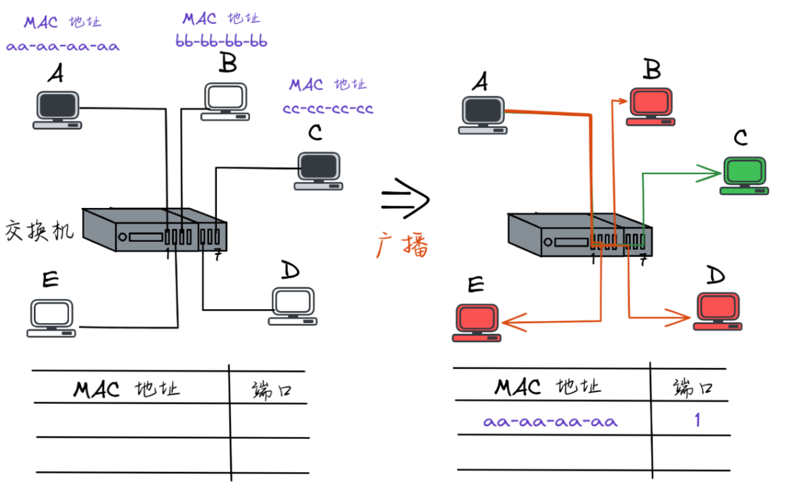
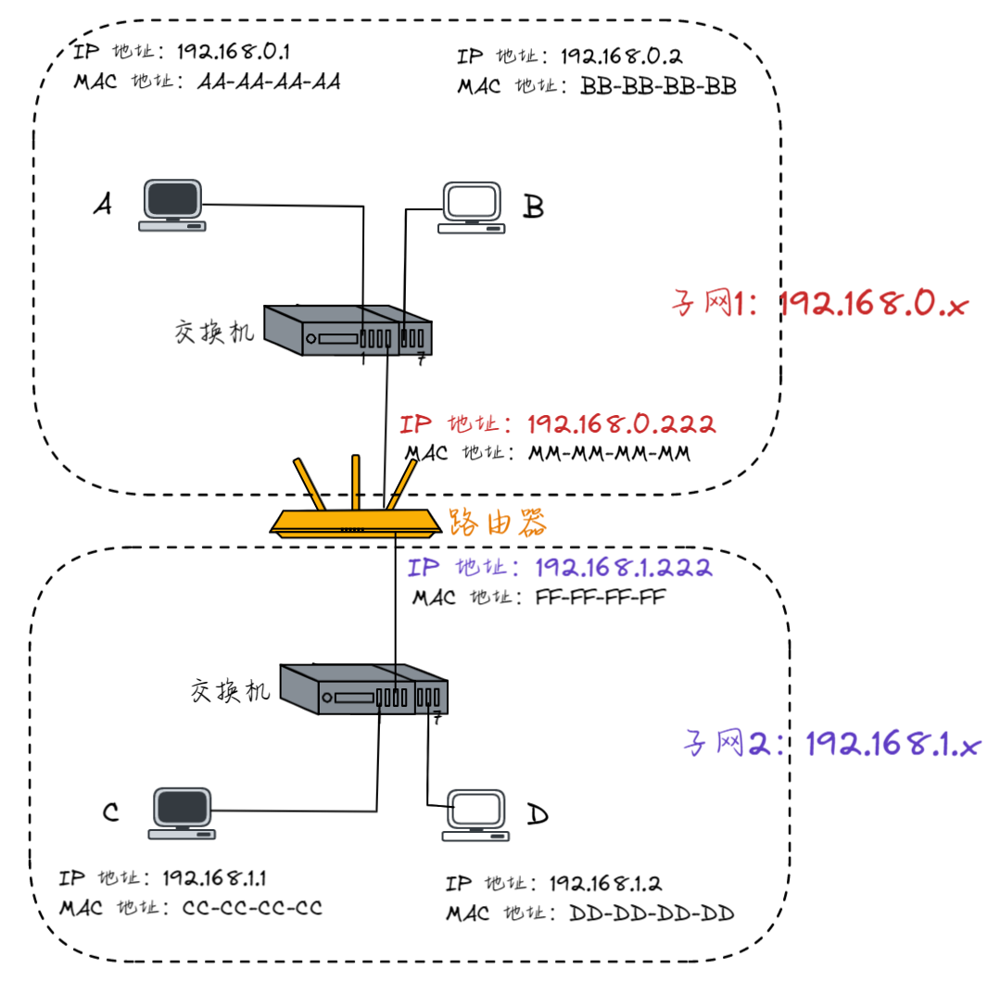
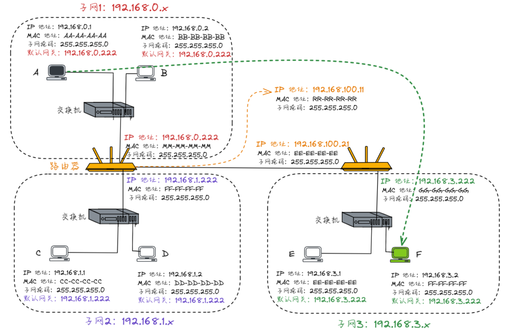

## 什么是数据?
数据从应用层开始层层封装，到达物理层进行传输的时候，数据已经被封装了很多东西了。
应用层首部——>传输层首部——>网络层首部——>数据链路层首部——>你的数据
首部里面包含如下几个重要的字段:

1. 源IP地址
2. 源MAC地址
3. 目标IP地址
4. 目标MAC地址
> 每一台计算机都有自己的IP地址和MAC地址

## 集线器
所有的主机都连接到集线器上，每次发送数据都需要进行广播(已经淘汰)
## 交换机
也是将所有主机都连接到交换机上，第一次发送数据需要广播，广播之后从MAC地址表中选择向哪一个端口发送数据。
事实上，交换机内部维护一张MAC地址表，记录着每一个MAC地址的设备，连接到哪一个端口上。

   1. 如果发来的包首部中包含的目标MAC地址在MAC地址表中没有映射关系，交换机就将此包广播给所有的端口，也即发给所有机器。
   2. 如果地址表有映射，那就只发给拿一个端口。

## 路由器
随着计算机设备越来越多，交换机的端口都不够用了，当然你肯定想到可以将多个交换机互相连接起来，然后每个交换机之间都互相共享它们的MAC地址表，但是，比如有10亿台设备，100万个交换机，那么这100万个交换机都需要各自维护包含10亿条记录的MAC地址表。
路由器同样有很多端口，每一个端口都连着一个子网

事实上，路由器内部同样维护着一张表，这张表被称为**路由表,**记录着每一个局域网(IP地址段)和它对应的端口。比如某个路由器的端口0连接着192.168.0.x的IP地址
比如某个路由器的端口0连接着192.168.0.x的IP地址段，端口1连接着192.168.1.x的IP地址段，那么路由表就是下面这样的:

| 目的地址 | 端口 | 下一跳 |
| --- | --- | --- |
| 192.160.0.0/24 | 0 |  |
| 192.168.0.1/24 | 1 |  |

**为什么路由表中有下一跳?**
这是因为一个路由器的端口毕竟是有限的，不可能一个路由器连接所有的IP地址段，因此，如果该路由器发现目标计算机的IP地址不在自己的管辖的IP地址段之内，就会通过下一跳转发给其他管辖这个IP地址的路由器。
**路由器具体是如何工作的?**
比如A给C发送数据，A在子网号为192.168.0.x的子网，而C在子网号为192.168.1.x的子网，那么**A首先需要知道C和子集是不是在同一个子网**:

- 如果**是**同一个子网，那么直接把数据发送给交换机就行了
- 如果**不是**在同一个子网，那么需要经过路由器的转发，A需要把数据通过交换机发送给路由器，然后由路由器决定该发送给哪个子网。

**这里有两个问题**

1. A如何判断是否和C在同一个子网?:直接做与运算
2. A如何知道那个设备是路由器:	每个路由器都要设置【默认网关】,A会把数据包发送给默认网关。

> 局域网和子网的区别:局域网是一个比较常见的子网类型，一个局域网可能由一个或者多个子网组成，而一个子网可能是一个独立的网络或者是一个局域网的一部分。

> 网关指的是在同一个网络中，用于连接不同子网之间的设备或者程序，它能够实现不同网络之间的数据包转发和协议转换。

## 总结
如下图A给F发送一个数据包，我们来梳理一下整个通信流程：

1）首先 A（192.168.0.1）通过子网掩码（255.255.255.0）计算出自己与 F（192.168.3.2）并不在同一个子网内，于是决定发送给默认网关（192.168.0.222）
2）A 通过 ARP 协议找到 默认网关 192.168.0.222 的 MAC 地址（数据链路层需要知道 MAC 地址才能传输数据）
3）A 将源 MAC 地址（AA-AA-AA-AA）与网关 MAC 地址（MM-MM-MM-MM）封装在数据链路层头部，又将源 IP 地址（192.168.0.1）和目的 IP 地址（192.168.3.2）（注意这里千万不要以为填写的是默认网关的 IP 地址，**从始至终这个数据包的两个 IP 地址都是不变的，只有 MAC 地址在不断变化**）封装在网络层头部，然后发送数据包

4）第一个交换机收到数据包后，发现目标 MAC 地址是 MM-MM-MM-MM，转发给第一个路由器
5）数据包来到了第一个路由器，发现其目标 IP 地址是 192.168.3.2，查看其路由表，发现了下一跳的地址是 192.168.100.21
6）所以此时该路由器需要做两件事，一是再次匹配路由表，找到下一跳 192.168.100.21 匹配的端口号，二是从这个端口把数据包转发出去
7）此时第二个路由器收到了数据包，看到其目的地址是 192.168.3.2，查询其路由表找到匹配的端口号，并准备从该端口把数据包转发出去
8）但此时路由器需要知道 192.168.3.2 的 MAC 地址才行，于是查看其 ARP 缓存，找到其 MAC 地址为 FF-FF-FF-FF，并将其封装在数据链路层头部，从上个步骤确定的端口将包转发出去。
9）如上图所示，对应的交换机收到了数据包，发现目的 MAC 地址为FF-FF-FF-FF，查询其 MAC 地址表，从对应的端口把数据包发出去。
10）数据包最终成功抵达计算机 F，F 发现目的 MAC 地址就是自己，于是收下了这个数据包
> 路由器和交换机中都含有ARP缓存

