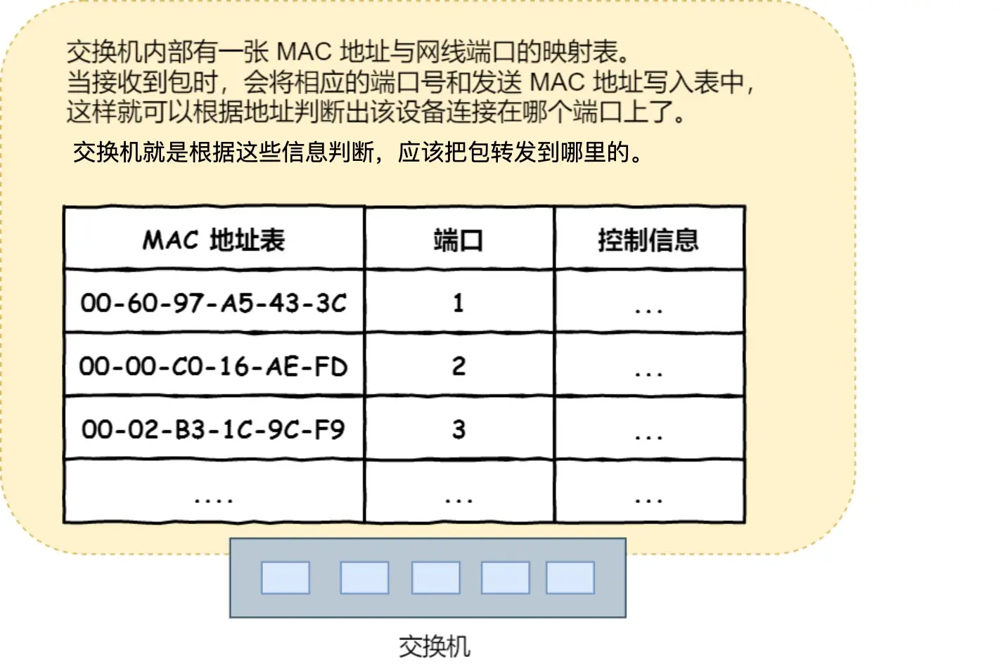

## 冷知识
- 目标地址和子网掩码都是 0.0.0.0，这表示默认网关，如果其他网卡没匹配上就会走默认网关
- 路由器是基于IP设计的，俗称三级网络设备，路由器上的每个端口都具有MAC地址和IP地址,因此它能够成为以太网的接收方和发送方。
- 而交换机是基于以太网设计的，俗称二级网络设备，交换机的端口不具有MAC地址。

## 命令相关
- route -n:route表命令相关
- route print:打印路由表

## 局域网技术
- WLAN:无线局域网技术：为了安全性，可以采用随机mac地址的形式
- 以太网：有线局域网技术，使用mac地址实现

## MAC地址的应用
mac地址主要应用于局域网中：
- 在以太网中，MAC地址用于识别网络中的设备，确保数据能够准确地发送到正确的设备。
- 为了保护用户的隐私和提升WLAN使用的安全性，现代的手机和平板设备在连接不同的Wi-Fi热点时，可能会默认使用不同的随机MAC地址，以防止个人信息泄露。

## 网卡、网关、网桥
- 网卡：一个网卡对应一个IP地址，将数字信息转换为电信息，才能够在网线上传输，控制网卡还需要网卡驱动程序。
- 网关：协议转换器

## 交换机
- 在ARP协议中，我们知道计算机的网卡本身具有 MAC 地址，并通过核对收到的包的接收方 MAC 地址判断是不是发给自己的，如果不是发给自己的则丢弃；相对地，交换机的端口不核对接收方 MAC 地址，而是直接接收所有的包并存放到缓冲区中。因此，和网卡不同，交换机的端口不具有 MAC 地址

- 如果交换机并没有在MAC地址表中找到对应的关系，就会广播到除了源端口的所有端口，然后只有相应的接收者才接收包，而其他设备则会忽略这个包。

